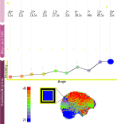

#+TITLE: Figures
#+STARTUP: hideblocks
#+PANDOC_OPTIONS: self-contained:t
#+OPTIONS: ^:nil
#+PROPERTY: header-args :eval never-export :exports both
# #+INFOJS_OPT: view:content
#+HTML_HEAD: 
* Code snippets :noexport:
Mathworks has an org-babel github example!
https://raw.githubusercontent.com/mathworks/Emacs-MATLAB-Mode/refs/heads/default/examples/matlab-and-org-mode/matlab-and-org-mode.org
#+begin_src matlab :session :results none
addpath('funcs/'); % niishow
addpath('/opt/ni_tools/matlab_toolboxes/nifti_tools'); % https://github.com/mcnablab/NIFTI_toolbox
figure(1, "visible", "off" );
#+end_src
* Take aways

 - want to automate picking best aquisition angle for a given region
    - signal depend
 - but single volume EPI intensity does not predict tSNR value
 - kspace rotations (simulation) do not correlate with observed tSNR (**TODO** check mean?). Cannot show limitiation is partial voluming.
 - 3dEPI does not correlate with observed tSNR. Cannot show limitiatino is due to inflow.
 - 3dEPI tSNR has structure not seen in EPI

* Logistics
existing abstract
https://echo.ismrm.org/abstracts/view/31ca4c92-36d3-420d-8884-53569968a4a0

poster upload
https://echo.ismrm.org/conferences/ISMRM2026/digital-poster/17019/edit

image, gif, video max 10Mb

Default sections: Impact, Motivation, Goals, Approach, Results

* Data collected

| desc                 | path                                |            |
|----------------------+-------------------------------------+------------|
| 0,-40,-45            | Data/bids/sub-cm20230803            | 2023-08-03 |
| phantom n40p20       | Data/bids-phantom/sub-20251020/     | 2025-10-20 |
| WF&CM, 10 rest       | Data/bids-a10/sub-{1,2}/            | 2025-10-22 |
| 3dGRE 7x 2D, 1x 3D   | Data/20260114BOLDSlcAng1/Processing | 2026-01-14 |
| iso, 5 rest          | Data/bids-3depi2x2x2/sub-1iso3d/    | 2026-03-24 |
| 2x2x3, no fm, 5 rest | Data/bids-3depi/sub-1/              | 2026-02-25 |

** parameters

Elsewhere reported like "2 mm × 2 mm × 2 mm [(FoV read, 200 mm), (FoV phase, 100%), (Slice thickness, 2.00 mm), (TR/TE, 2230/23 ms)]"

| seq      |  nt | res (mm) |        TR |        TE | FA | FoV read |                   |
|----------+-----+----------+-----------+-----------+----+----------+-------------------|
| MSA      |  10 |    2x2x2 |      5500 |        30 | 90 |      208 |                   |
| fmap     |     |    2x2x2 |       990 | 4.92,7.38 | 50 |      208 |                   |
| Rest     | 440 |    2x2x2 |       800 |        30 | 52 |      208 | GRAPPA R=4, SMS=4 |
| SpinEcho |     |    2x2x2 |      8000 |        66 | 90 |      208 |                   |
| 3dRest   | 200 |    2x2x2 | 2140 (60) |        27 | 10 |      208 | R=2, SMS=2        |
| 3dGRE    |     |    1x1x1 |        35 |        20 | 15 |      256 | R=3               |
| 2dGRE    |     |    2x2x2 |      1800 |        20 | 15 |      256 | R=3               |

see [[file:Data/2025-10-22/BOLDSliceOrient20251022.pdf]]
*** MSA

#+begin_src bash :results verbatim
DCMPROG='dicom_hdr -sexinfo' dcmdq ./Data/2025-10-22/Subject1/DICOM/A_EP2D_BOLD_ANG_N40P20_2MM_ASCEND_INCANG_0005/| grep -P 'ACQ Flip|(Echo|Repetition) Time|Array.ucMode'
#+end_src

#+RESULTS:
: 0018 0080        4 [9028    ] //            ACQ Repetition Time//5500
: 0018 0081        2 [9040    ] //                  ACQ Echo Time//30
: 0018 1314        2 [9296    ] //                 ACQ Flip Angle//90
: sSliceArray.ucMode	 = 	1

#+begin_src bash
jq 'with_entries(select(.key | test("Factor")))' Data/bids-a10/sub-1/func/sub-1_task-n40p20_acq-inc_bold.json
#+end_src

#+RESULTS:
: {}
*** Fieldmap

#+begin_src bash :results verbatim
DCMPROG='dicom_hdr -sexinfo' dcmdq ./Data/2025-10-22/Subject1/DICOM/GRE_FIELDMAP_LARGEFOV_0003/ | grep -P 'ACQ Flip|Slice Thick|(Echo|Repetition) Time|Array.ucMode'
dicom_hdr -sexinfo ./Data/2025-10-22/Subject1/DICOM/GRE_FIELDMAP_LARGEFOV_0003/BOLDSLICEANG_SUBJ1.MR.DEV-MOON_NEWSEQ.0003.0001.2025.10.22.16.45.13.765663.394490933.IMA | grep -P 'ACQ Flip|Slice Thick|(Echo|Repetition) Time|Array.ucMode'
#+end_src

#+RESULTS:
#+begin_example
0018 0050        4 [1488    ] //            ACQ Slice Thickness//2.5
0018 0080        4 [1500    ] //            ACQ Repetition Time//990
0018 0081        4 [1512    ] //                  ACQ Echo Time//7.38
0018 1314        2 [1756    ] //                 ACQ Flip Angle//50
sSliceArray.ucMode	 = 	4
0018 0050        4 [1488    ] //            ACQ Slice Thickness//2.5
0018 0080        4 [1500    ] //            ACQ Repetition Time//990
0018 0081        4 [1512    ] //                  ACQ Echo Time//4.92
0018 1314        2 [1756    ] //                 ACQ Flip Angle//50
sSliceArray.ucMode	 = 	4
#+end_example

*** SpinEcho

#+begin_src bash :results verbatim
DCMPROG='dicom_hdr -sexinfo' dcmdq ./Data/2025-10-22/Subject1/DICOM//SPINECHOFIELDMAP_AP_T_C0_0_0052| grep -P 'ACQ Flip|Slice Thick|(Echo|Repetition) Time|Array.ucMode|FoV|Phase.*Step|\[0\].dPhaseFOV'
#+end_src

#+RESULTS:
: 0018 0050        2 [8992    ] //            ACQ Slice Thickness//2
: 0018 0080        4 [9002    ] //            ACQ Repetition Time//8000
: 0018 0081        2 [9014    ] //                  ACQ Echo Time//66
: 0018 0089        4 [9092    ] //ACQ Number of Phase Encoding Steps//104
: 0018 1314        2 [9260    ] //                 ACQ Flip Angle//90
: 0051 100c       14 [216370  ] //                               //FoV 1872*1872
: sSliceArray.ucMode	 = 	4
: sSliceArray.asSlice[0].dPhaseFOV	 = 	208.0

#+begin_src bash :results verbatim
jq 'with_entries(select(.key | test("Factor")))' Data/bids-a10/sub-1/fmap/sub-1_acq-rest0_dir-AP_epi.json
3dinfo -ad3 -n4 ${_/.json/.nii.gz}
#+end_src

#+RESULTS:
: {}
: 2.000000	2.000000	2.000000	104	104	72	1

*** Rest

#+begin_src bash :results verbatim
DCMPROG='dicom_hdr -sexinfo' dcmdq ./Data/2025-10-22/Subject1/DICOM/BOLD_REST_AP_T_C20_0015/ | grep -P 'ACQ Flip|Slice Thick|(Echo|Repetition) Time|Array.ucMode|FoV|Phase.*Step|\[0\].dPhaseFOV'
#+end_src

#+RESULTS:
: 0018 0050        2 [8984    ] //            ACQ Slice Thickness//2
: 0018 0080        4 [8994    ] //            ACQ Repetition Time//800
: 0018 0081        2 [9006    ] //                  ACQ Echo Time//30
: 0018 0089        2 [9098    ] //ACQ Number of Phase Encoding Steps//91
: 0018 1314        2 [9288    ] //                 ACQ Flip Angle//52
: 0051 100c       14 [205412  ] //                               //FoV 1872*1872
: sSliceArray.ucMode	 = 	4
: sSliceArray.asSlice[0].dPhaseFOV	 = 	208.0

#+begin_src bash :results verbatim
jq 'with_entries(select(.key | test("Factor")))' Data/bids-a10/sub-1/func/sub-1_task-rest0_bold.json
#+end_src

#+RESULTS:
: {
:   "MultibandAccelerationFactor": 8
: }
*** 3dGRE 3dRest
#+begin_src bash :results verbatim
DCMPROG='dicom_hdr -sexinfo' dcmdq ./Data/2026.03.24-16.41.55/26.03.24-16:37:16-DST-1.3.12.2.1107.5.2.43.67078/a_ep3d_bold_fid_2mm_R2x2-20_936x936.11/ | grep -P 'ACQ Flip|Slice Thick|(Echo|Repetition) Time|Array.ucMode|FoV|Phase.*Step|\[0\].dPhaseFOV'
# TODO 20260506 wrong json file! this is 3d EPI
jq 'with_entries(select(.key | test("Factor")))' Data/bids-3depi2x2x2/sub-1iso3d/func/sub-1iso3d_task-rest_acq-n33_bold.json
3dinfo -tr -ad3 -n4 -extent ${_/.json/.nii.gz}
#+end_src

#+RESULTS:
#+begin_example
0018 0050        2 [8900    ] //            ACQ Slice Thickness//2
0018 0080        2 [8910    ] //            ACQ Repetition Time//60
0018 0081        2 [8920    ] //                  ACQ Echo Time//27
0018 0089        4 [8998    ] //ACQ Number of Phase Encoding Steps//103
0018 1314        2 [9166    ] //                 ACQ Flip Angle//10
0051 100c       14 [153938  ] //                               //FoV 1872*1872
sSliceArray.ucMode	 = 	4
sSliceArray.asSlice[0].dPhaseFOV	 = 	208.0
{
  "ParallelReductionFactorInPlane": 4
}
2.140000	2.000000	2.000000	2.000000	104	104	72	200	-104.000000	102.000000	-159.527039	46.472946	-84.261681	57.738304
#+end_example

*** 3dGRE structural

#+begin_src bash :results verbatim
dicom_hdr -sexinfo ./Data/20260114BOLDSlcAng1/DICOM/3DT2SGRE_R3X1_0008/BOLDSLCANG1.MR.DEV-MOON_BOLDSLICEANGLE.0008.0001.2026.01.14.16.47.15.702551.130815277.IMA | grep -P 'ACQ Flip|Slice Thick|(Echo|Repetition) Time|Array.ucMode|FoV|Phase.*Step|\[0\].dPhaseFOV'
dicom_hdr -sexinfo ./Data/20260114BOLDSlcAng1/DICOM/3DT2SGRE_R3X1_0008/BOLDSLCANG1.MR.DEV-MOON_BOLDSLICEANGLE.0008.0002.2026.01.14.16.47.15.702551.130815295.IMA| grep -P 'ACQ Flip|Slice Thick|(Echo|Repetition) Time|Array.ucMode|FoV|Phase.*Step|\[0\].dPhaseFOV'
jq 'with_entries(select(.key | test("Factor")))' ./Data/20260114BOLDSlcAng1/nii/3DT2SGRE_R3X1_0008.json
3dinfo -tr -ad3 -n4 ${_/.json/.nii.gz}
#+end_src

#+RESULTS:
#+begin_example
0018 0050        2 [1440    ] //            ACQ Slice Thickness//1
0018 0080        2 [1450    ] //            ACQ Repetition Time//35
0018 0081        2 [1460    ] //                  ACQ Echo Time//20
0018 0089        4 [1528    ] //ACQ Number of Phase Encoding Steps//255
0018 1314        2 [1682    ] //                 ACQ Flip Angle//15
0051 100c       12 [162290  ] //                               //FoV 256*256
sSliceArray.ucMode	 = 	4
sSliceArray.asSlice[0].dPhaseFOV	 = 	256.0
0018 0050        2 [1440    ] //            ACQ Slice Thickness//1
0018 0080        2 [1450    ] //            ACQ Repetition Time//35
0018 0081        2 [1460    ] //                  ACQ Echo Time//20
0018 0089        4 [1528    ] //ACQ Number of Phase Encoding Steps//255
0018 1314        2 [1682    ] //                 ACQ Flip Angle//15
0051 100c       12 [162290  ] //                               //FoV 256*256
sSliceArray.ucMode	 = 	4
sSliceArray.asSlice[0].dPhaseFOV	 = 	256.0
{
  "ParallelReductionFactorInPlane": 3
}
0.000000	1.000000	1.000000	1.000000	256	256	144	1
#+end_example

*** 2dGRE structural

#+begin_src bash :results verbatim
dicom_hdr -sexinfo ./Data/20260114BOLDSlcAng1/DICOM/2DT2SGRE_R3X1_0_0010/BOLDSLCANG1.MR.DEV-MOON_BOLDSLICEANGLE.0010.0001.2026.01.14.16.47.15.702551.130824119.IMA | grep -P 'ACQ Flip|Slice Thick|(Echo|Repetition) Time|Array.ucMode|FoV|Phase.*Step|\[0\].dPhaseFOV'
jq 'with_entries(select(.key | test("Factor")))' ./Data/20260114BOLDSlcAng1/nii/2DT2SGRE_R3X1_0_0010.json
3dinfo -ad3 -n4 ${_/.json/.nii.gz}
#+end_src

#+RESULTS:
#+begin_example
0018 0050        2 [1438    ] //            ACQ Slice Thickness//2
0018 0080        4 [1448    ] //            ACQ Repetition Time//1800
0018 0081        2 [1460    ] //                  ACQ Echo Time//20
0018 0089        4 [1538    ] //ACQ Number of Phase Encoding Steps//128
0018 1314        2 [1694    ] //                 ACQ Flip Angle//15
0051 100c       12 [194562  ] //                               //FoV 256*256
sSliceArray.ucMode	 = 	4
sSliceArray.asSlice[0].dPhaseFOV	 = 	256.0
{
  "ParallelReductionFactorInPlane": 3
}
2.000000	2.000000	2.000000	128	128	72	1
#+end_example

** Dimensions
#+begin_src bash :colnames '(dx dy dz nx ny nz nt tr fname)
find Data/bids* -iname 'sub-[12]*nii.gz' -ipath '*/func/*' -not -iname '*sbref*'  |xargs 3dinfo -ad3 -n4 -tr -iname | sed 's/Data.*func\///'
#+end_src

#+RESULTS:
|  dx |  dy |  dz |  nx |  ny | nz |  nt |    tr | fname                                        |
|-----+-----+-----+-----+-----+----+-----+-------+----------------------------------------------|
| 2.0 | 2.0 | 3.0 | 104 | 104 | 48 | 200 | 1.425 | sub-1_task-n13_acq-3d_bold.nii.gz            |
| 2.0 | 2.0 | 3.0 | 104 | 104 | 48 | 200 | 1.425 | sub-1_task-13_acq-3d_bold.nii.gz             |
| 2.0 | 2.0 | 3.0 | 104 | 104 | 48 | 200 | 1.425 | sub-1_task-n33_acq-3d_bold.nii.gz            |
| 2.0 | 2.0 | 2.0 | 104 | 104 | 72 |  10 |   5.5 | sub-1_task-n40p20_acq-inc_bold.nii.gz        |
| 2.0 | 2.0 | 3.0 | 104 | 104 | 48 | 200 | 1.425 | sub-1_task-n40_acq-3d_bold.nii.gz            |
| 2.0 | 2.0 | 3.0 | 104 | 104 | 48 | 200 | 1.425 | sub-1_task-20_acq-3d_bold.nii.gz             |

| 2.0 | 2.0 | 2.0 | 104 | 104 | 72 | 200 |  2.14 | sub-1iso3d_task-rest_acq-n33_bold.nii.gz     |
| 2.0 | 2.0 | 2.0 | 104 | 104 | 72 |  10 |   5.5 | sub-1iso3d_task-n40p20_bold.nii.gz           |
| 2.0 | 2.0 | 2.0 | 104 | 104 | 72 | 200 |  2.14 | sub-1iso3d_task-rest_acq-n40_bold.nii.gz     |
| 2.0 | 2.0 | 2.0 | 104 | 104 | 72 | 200 |  2.14 | sub-1iso3d_task-rest_acq-n13_bold.nii.gz     |
| 2.0 | 2.0 | 2.0 | 104 | 104 | 72 | 200 |  2.14 | sub-1iso3d_task-rest_acq-p13_bold.nii.gz     |
| 2.0 | 2.0 | 2.0 | 104 | 104 | 72 | 200 |  2.14 | sub-1iso3d_task-rest_acq-p20_bold.nii.gz     |
| 2.0 | 2.0 | 2.0 | 104 | 104 | 72 | 200 |  2.14 | sub-1iso3d_task-restn33_bold.nii.gz          |

| 2.0 | 2.0 | 2.0 | 104 | 104 | 72 | 440 |   0.8 | sub-2_task-restn33_bold.nii.gz               |
| 2.0 | 2.0 | 2.0 | 104 | 104 | 72 |  10 |   5.5 | sub-2_task-n40p20_acq-dec_bold.nii.gz        |
| 2.0 | 2.0 | 2.0 | 104 | 104 | 72 | 440 |   0.8 | sub-2_task-restn13_bold.nii.gz               |
| 2.0 | 2.0 | 2.0 | 104 | 104 | 72 | 440 |   0.8 | sub-2_task-restn6_bold.nii.gz                |
| 2.0 | 2.0 | 2.0 | 104 | 104 | 72 |  10 |   5.5 | sub-2_task-n40p20_acq-inc_bold.nii.gz        |
| 2.0 | 2.0 | 2.0 | 104 | 104 | 72 | 259 |   0.8 | sub-2_task-rest0_bold.nii.gz                 |
| 2.0 | 2.0 | 2.0 | 104 | 104 | 72 | 259 |   0.8 | sub-2_task-restn26_bold.nii.gz               |
| 2.0 | 2.0 | 2.0 | 104 | 104 | 72 |  10 |   5.5 | sub-2_task-n40p20_acq-dec_run-2_bold.nii.gz  |
| 2.0 | 2.0 | 2.0 | 104 | 104 | 72 | 259 |   0.8 | sub-2_task-rest6_bold.nii.gz                 |
| 2.0 | 2.0 | 2.0 | 104 | 104 | 72 | 440 |   0.8 | sub-2_task-restn39_bold.nii.gz               |
| 2.0 | 2.0 | 2.0 | 104 | 104 | 72 |  10 |   5.5 | sub-2_task-n40p20_acq-mid_run-2_bold.nii.gz  |
| 2.0 | 2.0 | 2.0 | 104 | 104 | 72 | 440 |   0.8 | sub-2_task-rest20_bold.nii.gz                |
| 2.0 | 2.0 | 2.0 | 104 | 104 | 72 | 259 |   0.8 | sub-2_task-rest13_bold.nii.gz                |
| 2.0 | 2.0 | 2.0 | 104 | 104 | 72 | 259 |   0.8 | sub-2_task-restn19_bold.nii.gz               |
| 2.0 | 2.0 | 2.0 | 104 | 104 | 72 |  10 |   5.5 | sub-2_task-n40p20_acq-inc_run-2_bold.nii.gz  |

| 2.0 | 2.0 | 2.0 | 104 | 104 | 72 |  10 |   5.5 | sub-1_task-n40p20_acq-mid_bold.nii.gz        |
| 2.0 | 2.0 | 2.0 | 104 | 104 | 72 | 440 |   0.8 | sub-1_task-restn33_bold.nii.gz               |
| 2.0 | 2.0 | 2.0 | 104 | 104 | 72 | 440 |   0.8 | sub-1_task-restn39_bold.nii.gz               |
| 2.0 | 2.0 | 2.0 | 104 | 104 | 72 | 259 |   0.8 | sub-1_task-rest6_bold.nii.gz                 |
| 2.0 | 2.0 | 2.0 | 104 | 104 | 72 | 259 |   0.8 | sub-1_task-rest0_bold.nii.gz                 |
| 2.0 | 2.0 | 2.0 | 104 | 104 | 72 | 259 |   0.8 | sub-1_task-restn19_bold.nii.gz               |
| 2.0 | 2.0 | 2.0 | 104 | 104 | 72 |  10 |   5.5 | sub-1_task-n40p20_acq-inc_bold.nii.gz        |
| 2.0 | 2.0 | 2.0 | 104 | 104 | 72 | 139 |   0.8 | sub-1_task-restn13_bold.nii.gz               |
| 2.0 | 2.0 | 2.0 | 104 | 104 | 72 | 259 |   0.8 | sub-1_task-rest13_bold.nii.gz                |
| 2.0 | 2.0 | 2.0 | 104 | 104 | 72 | 440 |   0.8 | sub-1_task-restn6_bold.nii.gz                |
| 2.0 | 2.0 | 2.0 | 104 | 104 | 72 | 440 |   0.8 | sub-1_task-rest20_bold.nii.gz                |
| 2.0 | 2.0 | 2.0 | 104 | 104 | 72 | 259 |   0.8 | sub-1_task-restn26_bold.nii.gz               |
| 2.0 | 2.0 | 2.0 | 104 | 104 | 72 |  10 |   5.5 | sub-1_task-n40p20_acq-dec_bold.nii.gz        |

| 2.0 | 2.0 | 2.0 | 104 | 104 | 72 |  10 |   5.5 | sub-20251020_task-n40p20_acq-inc_bold.nii.gz |
| 2.0 | 2.0 | 2.0 | 104 | 104 | 72 |  10 |   5.5 | sub-20251020_task-n40p20_acq-dec_bold.nii.gz |
| 2.0 | 2.0 | 2.0 | 104 | 104 | 72 | 440 |   0.8 | sub-20251020_task-c20_bold.nii.gz            |
| 2.0 | 2.0 | 2.0 | 104 | 104 | 72 |  10 |   5.5 | sub-20251020_task-n40p20_acq-mid_bold.nii.gz |

** BIDS tree
#+begin_src bash :results verbatim
  tree Data/bids* -P '*task*.nii.gz'
#+end_src

#+RESULTS:
#+begin_example
Data/bids
└── sub-cm20230803
    ├── anat
    ├── fmap
    └── func
        ├── sub-cm20230803_task-anglechange_bold.nii.gz
        ├── sub-cm20230803_task-n40_bold.nii.gz
        ├── sub-cm20230803_task-n40_sbref.nii.gz
        ├── sub-cm20230803_task-n45_bold.nii.gz
        ├── sub-cm20230803_task-n45_sbref.nii.gz
        ├── sub-cm20230803_task-p00_bold.nii.gz
        └── sub-cm20230803_task-p00_sbref.nii.gz
Data/bids-3depi
└── sub-1
    ├── anat
    ├── fmap
    └── func
        ├── sub-1_task-13_acq-3d_bold.nii.gz
        ├── sub-1_task-20_acq-3d_bold.nii.gz
        ├── sub-1_task-n13_acq-3d_bold.nii.gz
        ├── sub-1_task-n33_acq-3d_bold.nii.gz
        ├── sub-1_task-n40_acq-3d_bold.nii.gz
        └── sub-1_task-n40p20_acq-inc_bold.nii.gz
Data/bids-3depi2x2x2
└── sub-1iso3d
    ├── anat
    ├── fmap
    └── func
        ├── sub-1iso3d_task-n40p20_bold.nii.gz
        ├── sub-1iso3d_task-rest_acq-n13_bold.nii.gz
        ├── sub-1iso3d_task-rest_acq-n33_bold.nii.gz
        ├── sub-1iso3d_task-rest_acq-n40_bold.nii.gz
        ├── sub-1iso3d_task-rest_acq-p13_bold.nii.gz
        └── sub-1iso3d_task-rest_acq-p20_bold.nii.gz
Data/bids-3depi2x2x2-cp-acq-as-task
└── sub-1iso3d
    ├── anat
    ├── fmap
    └── func
        └── sub-1iso3d_task-restn33_bold.nii.gz
Data/bids-a10
├── sub-1
│   ├── anat
│   ├── fmap
│   └── func
│       ├── sub-1_task-n40p20_acq-dec_bold.nii.gz
│       ├── sub-1_task-n40p20_acq-inc_bold.nii.gz
│       ├── sub-1_task-n40p20_acq-mid_bold.nii.gz
│       ├── sub-1_task-rest0_bold.nii.gz
│       ├── sub-1_task-rest0_sbref.nii.gz
│       ├── sub-1_task-rest13_bold.nii.gz
│       ├── sub-1_task-rest13_sbref.nii.gz
│       ├── sub-1_task-rest20_bold.nii.gz
│       ├── sub-1_task-rest20_sbref.nii.gz
│       ├── sub-1_task-rest6_bold.nii.gz
│       ├── sub-1_task-rest6_sbref.nii.gz
│       ├── sub-1_task-restn13_bold.nii.gz
│       ├── sub-1_task-restn13_sbref.nii.gz
│       ├── sub-1_task-restn19_bold.nii.gz
│       ├── sub-1_task-restn19_sbref.nii.gz
│       ├── sub-1_task-restn26_bold.nii.gz
│       ├── sub-1_task-restn26_sbref.nii.gz
│       ├── sub-1_task-restn33_bold.nii.gz
│       ├── sub-1_task-restn33_sbref.nii.gz
│       ├── sub-1_task-restn39_bold.nii.gz
│       ├── sub-1_task-restn39_sbref.nii.gz
│       ├── sub-1_task-restn6_bold.nii.gz
│       └── sub-1_task-restn6_sbref.nii.gz
└── sub-2
    ├── anat
    ├── fmap
    └── func
        ├── sub-2_task-n40p20_acq-dec_bold.nii.gz
        ├── sub-2_task-n40p20_acq-dec_run-2_bold.nii.gz
        ├── sub-2_task-n40p20_acq-inc_bold.nii.gz
        ├── sub-2_task-n40p20_acq-inc_run-2_bold.nii.gz
        ├── sub-2_task-n40p20_acq-mid_run-2_bold.nii.gz
        ├── sub-2_task-rest0_bold.nii.gz
        ├── sub-2_task-rest0_sbref.nii.gz
        ├── sub-2_task-rest13_bold.nii.gz
        ├── sub-2_task-rest13_sbref.nii.gz
        ├── sub-2_task-rest20_bold.nii.gz
        ├── sub-2_task-rest20_sbref.nii.gz
        ├── sub-2_task-rest6_bold.nii.gz
        ├── sub-2_task-rest6_sbref.nii.gz
        ├── sub-2_task-restn13_bold.nii.gz
        ├── sub-2_task-restn13_sbref.nii.gz
        ├── sub-2_task-restn19_bold.nii.gz
        ├── sub-2_task-restn19_sbref.nii.gz
        ├── sub-2_task-restn26_bold.nii.gz
        ├── sub-2_task-restn26_sbref.nii.gz
        ├── sub-2_task-restn33_bold.nii.gz
        ├── sub-2_task-restn33_sbref.nii.gz
        ├── sub-2_task-restn39_bold.nii.gz
        ├── sub-2_task-restn39_sbref.nii.gz
        ├── sub-2_task-restn6_bold.nii.gz
        └── sub-2_task-restn6_sbref.nii.gz
Data/bids-phantom
└── sub-20251020
    ├── fmap
    └── func
        ├── sub-20251020_task-c20_bold.nii.gz
        ├── sub-20251020_task-c20_sbref.nii.gz
        ├── sub-20251020_task-n40p20_acq-dec_bold.nii.gz
        ├── sub-20251020_task-n40p20_acq-inc_bold.nii.gz
        └── sub-20251020_task-n40p20_acq-mid_bold.nii.gz

33 directories, 73 files
#+end_example

** 3dGRE
3dGRE isn't bids-ified
#+begin_src  bash
ls Data/20260114BOLDSlcAng1/nii/[23]D*[0-9].json|sed -E 's:.*/|_[0-9]+.json::g'|sort -u|grep -Pv 'TEST|RR'
#+end_src

#+RESULTS:
| 2DT2SGRE_R3X1_0   |
| 2DT2SGRE_R3X1_N10 |
| 2DT2SGRE_R3X1_N20 |
| 2DT2SGRE_R3X1_N30 |
| 2DT2SGRE_R3X1_N40 |
| 2DT2SGRE_R3X1_P10 |
| 2DT2SGRE_R3X1_P20 |
| 3DT2SGRE_R3X1     |

* Derivatives
 * func/rest @ each angle
    * SDC corrected resting state
    * tsnr
    * 36P preprocessed
 * SDC corrected (largefov) n40p20 angle change single epi
 * largefov GRE fieldmap (->phasediff)
 * 3dGRE rotated and downsampled in ksapce
 * angeograph

* Figures
- animated (?) tsnr for select ROIs (AON PirF PirT Tub)
  * glasser?
- fmap vs tsnr (correlation)
- blip/spin echo cor across angles?

* Input Data
** Multi Angle EPI
 Max diff per voxel for MNI aligned tSNR files like ~../Data/tsnr/sub-1_task-restn39_tsnr.nii.gz~ (matlab)
#+begin_src matlab :session :exports both :results file graphics :file Figures/orgmode/tsnr.png :width 200
tsnr = niftiread('AngleCompare/maxangle_mni/tsnr-range.nii.gz');
niishow(fliplr(rot90(permute(tsnr,[3 2 1]),2)));
#+end_src

#+ATTR_ORG: width: 200px
#+RESULTS:
[[file:Figures/orgmode/tsnr.png]]

 
 
 
 
 
 
 
 
 
 
 
 
 
 
 
 
 
 
 
 
 
 
 
 
 
 
 
 
 
 
 
 
 
 
 
 
 
 
 
 

Code for similiar in R
#+begin_src R :session
a10_rest_f <- Sys.glob('../Data/preproc/fmriprep-25.2.3/sub-*/func/sub-*_task-rest*_space-MNI152NLin2009cAsym_desc-mean_bold.nii.gz')
sdc_a10_files <- Sys.glob('../FmapCorrect/wf/human-largefov/sub-[12]/epi_undistorted_masked.nii.gz')
tsnr_range <- oro.nifti::readNIfTI('./maxangle_mni/tsnr-range.nii.gz')@.Data
#+end_src
* MSA sequence
see  which uses [[file:Figures/montage_nifit.R]] for nifti slice images.
 
 
 
 
 
 
 
 
 
 
 
 
 
 

Time and angle pairs used in inkscape labels. (Extension->Text->Text Split)
#+begin_src R  :session
source('msa_funcs.R')
msa_tr <- 5.5
paste(msa_angles, msa_tr*c(1:10), sep="°@", collapse="s ")
#+end_src

#+RESULTS:
: -40°@5.5s -33°@11s -27°@16.5s -20°@22s -13°@27.5s -7°@33s 0°@38.5s 7°@44s 13°@49.5s 20°@55

* a10 vs mean vs tsnr
Is the ~a10~ sequence representative? Does the epi intensity relate to tSNR?
Means are generated after fmriprep. see [[file:AngleCompare/02d_mean.bash]] for rest and [[file:AngleCompare/02c_mni_warp.bash]] for a10

#+begin_src R :session :results none
source('./msa_funcs.R') # msa_angles, rest_subj_angle, niifile_vec
mni_mask <- readNifti('AngleCompare/mni_brainmask.nii.gz')
nii_vec_df <- function(f) data.frame(value=niifile_vec(f, mask=mni_mask)) |> mutate(i=1:n())

# all resting state means from 02d
niilist <- Sys.glob('Data/preproc/bids-*/fmriprep-25.2.3/sub-*/func/sub-*_task-rest*_space-MNI152NLin2009cAsym_desc-mean_bold.nii.gz')

niilist_id_angle <- rest_subj_angle(niilist)
# named like sub-1_-40
names(niilist) <- apply(niilist_id_angle, 1,paste,collapse="_") |> gsub(" ","",x=_)

rest_means <- lapply(niilist, niifile_vec)
niilist_all_cor <- cor(do.call(data.frame, rest_means), use="pairwise.complete.obs")
dimnames(niilist_all_cor)[[1]] <-names(niilist)
dimnames(niilist_all_cor)[[2]] <-names(niilist)
#+end_src

Average whole-brain voxel-to-voxel BOLD intensity within visit correlation
  * high between angles.
  * across particiapnt has low voxel-to-voxel mean correlation. (MNI warped)
     * ~sub-1~ 3dEPI more correlated to ~sub-1~ 2D than ~sub-2~
  * Bigger range/angle changes in 3dEPI.

**NB** no fieldmap correction for 3dEPI (spin echos collected are not 3d; maybe other yet-to-be diagnosed fmriprep issues)

Look at ROI specific values for tSNR below. **Should also show ROI means (in addition to whole brain voxelwise) here?**

#+begin_src R :session :results graphics file :file Figures/orgmode/rest_mean_correlatons.png
#uptr_rest_cor <- niilist_all_cor
#uptr_rest_cor[upper.tri(uptr_rest_cor, diag=T)] <- NA
rest_mean_df <- niilist_all_cor |> reshape2::melt() |>
  separate(Var1, c('sub1','angle1'), sep="_") |>
  separate(Var2, c('sub2','angle2'), sep="_")|>
  mutate(across(matches("angle"),as.numeric))

ggplot(rest_mean_df) +
  aes(x=angle1, y=angle2, shape=sub1, color=value, size=abs(value)) +
  scale_color_distiller(palette="Spectral") +
  #geom_jitter(width=.3, height=.3, alpha=.9) +
  geom_point()+
  facet_grid(sub1~sub2) +
  theme_minimal() +
  labs(title="Mean Rest correlation")
#+end_src

#+RESULTS:
[[file:Figures/orgmode/rest_mean_correlatons.png]]
 
 
 
 
 
 
 
 
 
 
 
 
 
 
 
 
 
 
 
 
 
 
** explode angles (functions)
Code to pull out each of the single volume angle acquisitions built into ~n40p20~
#+begin_src R :session :results none

                                        # read in all n40 to p20 "a10" quick epis
a10list <- Sys.glob('Data/preproc/bids-*/fmriprep-25.2.3/sub-*/func/sub-*n40p20*_space-MNI152NLin2009cAsym_desc-preproc_bold.nii.gz') |>
  grep(invert=T,value=T,pattern="run-2|3depi/|-mid|-dec")
                                        # name by BIDS sub
stopifnot(length(a10list) == 3)

angle_vals <- msa_angles # c(-40, -33, -27, -20, -13, -7, 0, 7, 13, 20) # 20260503-use msa_funcs.R msa_angles
a10explode <- function(a10file) {
                                        #a10file <- a10list[[1]]
  subj <- stringr::str_extract(a10file,'(?<=sub-)[^/_]+')
  img4d <- RNifti::readNifti(a10file)
  exploded <- apply(img4d, 4, as.vector, simplify=F)
  names(exploded) <- paste(subj, as.character(angle_vals),sep="_")
                                        #stopifnot(all(x[,,,5]==y[[5]])-
  return(exploded)
}
cor_melt <- function(x, from){
  res <- cor(x, use="pairwise.complete.obs")
  dimnames(res)[[1]] <- names(x)
  dimnames(res)[[2]] <- names(x)
  reshape2::melt(res) |>
    mutate(from=from, across(c(Var1,Var2), as.character)) |>
    filter(Var1!=Var2)
}
#+end_src

** ΔB0
sdcflow run inside fmriprep AP - PA to get Hz fieldmap. Warped to MNI with [[file:./AngleCompare/04_fmapwarp.bash]]
#+begin_src R :session :results none
# read in sub-1 fmaps
# Data/preproc/bids-a10/fmriprep-25.2.3/sub-1/fmap/sub-1_acq-rest0_fmapid-auto00001_space-MNI152NLin2009cAsym_desc-preproc_fieldmap.nii.gz
b0_list <- Sys.glob('Data/preproc/bids-a10/fmriprep-25.2.3/sub-*/fmap/*MNI152*_res-native_*fieldmap.nii.gz') |>
  grep(invert=T,value=T,pattern="run-2|3depi/|-mid|-dec")
# names are subid_angle
names(b0_list) <- rest_subj_angle(b0_list) |>
  apply(1,paste,collapse="_") |>
  gsub(" ","",x=_)
# list of vectors ready for cor, like exploded a10
b0s_vecs <- lapply(b0_list, niifile_vec)
#+end_src

** magnitude, ΔB0, tSNR correlations
Relation between the single volume angle acqusition and
#+begin_src R :session :results none

a10_vecs <- do.call(c, lapply(a10list, a10explode))
names(a10_vecs)
names(niilist)
setdiff(names(a10_vecs), names(niilist)) # niilist missing what wasn't collected: "1iso3d_-27" "1iso3d_-20" "1iso3d_-7"  "1iso3d_0"   "1iso3d_6"
stopifnot(setdiff(names(niilist), names(a10_vecs)) == c())  # but a10 should have eveything (and more) in niilist

tsnrlist <- Sys.glob("Data/tsnr/*/sub-*_task-rest*_tsnr.nii.gz")
tsnr_id_angle <- rest_subj_angle(niilist)
stopifnot(all(!duplicated(tsnr_id_angle)))
                                        # named like sub-1_-40
names(tsnrlist) <- apply(niilist_id_angle, 1,paste,collapse="_") |> gsub(" ","",x=_)
rest_tsnr <- lapply(tsnrlist, niifile_vec)
#+end_src

Per whole brain voxelwise correations at each angle for each measure (a10/n40p20, b0, mean, tsnr) pair.
  * highest correlation between a10 and mean rest (phew!)
  * a10 decreases correlation with tSNR as angle increases
  * 3dEPI direction opposite of 2D. rest<->a10; mean<->tsnr
  * little correlation between b0 and others.
    * decreasing (0 to more negative) compared to a10 for sub-1
    * increasing (0 to more positive) compared to tsnr for sub-2

**TODO: show with ROIs instead of whole brain?**

#+begin_src R :session :results graphics file :file Figures/orgmode/rest_a10_correlatons.png

between_acq_cors <- lapply(names(niilist), \(n){
  data.frame(msa=a10_vecs[[n]],
             mean_rest=rest_means[[n]],
             tsnr_rest=rest_tsnr[[n]],
             B0=(if(n %in% names(b0s_vecs)) b0s_vecs[[n]] else NA)
                                        # TODO
                                        # b0, spin-echo b0, sd
             ) |> cor_melt(n)})|>
  bind_rows() |>
  separate(from, c('subj','angle'), sep="_") |>
  mutate(angle=as.numeric(angle))

between_acq_cors |> #filter(Var1=='a10') |>
  ggplot()+
  aes(x=angle, y=value, color=subj) +
  geom_smooth(alpha=.2, aes(group=paste(subj,Var1,Var2)),method='lm') +
  geom_point() +
  theme_minimal() +
  facet_grid(Var1~Var2) +
  labs(title="Relation between mean rest and MSA(ɸ)", y="Voxelwise Correlation", x="Acq. Angle")
#+end_src

#+RESULTS:
[[file:Figures/orgmode/rest_a10_correlatons.png]]
 
 
 
 
 
 
 
 
 
 
 
 
 
 
 
 
 
 
 
 
 
 

* tSNR of ROIs at angles (animated)
Justification. **CITE**
AON tSNR decorates

from [[file:Olfactory/01_roistat_tsnr.bash]] and [[file:Olfactory/02_tsnr_model.R]]

#+HTML: <source src="tSNR_angle.mp4" type="video/mp4">
[[file:tSNR_angle.mp4]]

** TODO any ROI where tSNR is worse at +20?

* Max angle tSNR vs a10 vs ΔB0
From [[file:AngleCompare/03a_tsnr_cmp.R]].

We find the aquisition angle that has the maximum magnitude using the a10 n40p20 sequence and the full resting state tSNR.
Then correlate angle to voxelwise across the whole brain between tSNR and a10 mangtinute highest angle (-40 to 20) and to fieldamp computed ~ΔB0~.

**Suprprsingly(?)**,  voxelwise angle-at-maxium for tSNR is neither highly correlated with angle of highest (single volume) bold magnitude nor estimated B0 values.
# [[./AngleCompare/images/a10_plane.png]]

** Correlation

Correlations between acquisitions extracted from [[file:AngleCompare/03a_tsnr_cmp.R]]
#+begin_src R :session :results none
#angle_cut <- function(x) cut(as.vector(x),breaks=c(-Inf,-7,7, Inf)) |> as.numeric()

images_to_cor <- list(
  # maxangle's use a10 processed with bespoke reslice+fugue. NB. sub-1 n40p20 fmriprep has no FM correction. others look bad
  msa_1='AngleCompare/maxangle_mni/sub-1_angleatmax-n40p20_subset5.nii.gz',
  msa_2='AngleCompare/maxangle_mni/sub-2_angleatmax-n40p20_subset5.nii.gz',
  # ERROR!! starts at 0 instead of -20
  #msa_s1_3d = 'AngleCompare/maxangle_mni/sub-1_ses-iso3d_a10_space-MNI_maxangle.nii.gz',
  #msa_3d1 = 'AngleCompare/maxangle_mni/sub-1e3d_a10_space-MNI_maxangle.nii.gz',
  # 20260504 use subset version (created with AngleCompare/02b_tsnr_angle.bash)
  msa_3d1 = 'AngleCompare/maxangle_mni/sub-1ni3d_angleatmax-n40p20_subset5.nii.gz',

  b0_1='AngleCompare/maxangle_mni/sub-1_space-MNI152NLin2009cAsym_fmapDirect.nii.gz',
  b0_2='AngleCompare/maxangle_mni/sub-2_space-MNI152NLin2009cAsym_fmapDirect.nii.gz',
  b0_3d1='AngleCompare/maxangle_mni/sub-1iso3d_space-MNI152NLin2009cAsym_fmapDirect.nii.gz',

  tsnr_1='AngleCompare/maxangle_mni/sub-1_select-n40n33n13p13p20_angleatmax-tsnr.nii.gz',
  tsnr_2='AngleCompare/maxangle_mni/sub-2_select-n40n33n13p13p20_angleatmax-tsnr.nii.gz',
  tsnr_3d1 = 'AngleCompare/maxangle_mni/3depi2x2x2/sub-1iso3d_angleatmax-tsnr.nii.gz',

  sd_1='AngleCompare/maxangle_mni/sub-1_select-n40n33n13p13p20_angleatmax-sd.nii.gz',
  sd_2='AngleCompare/maxangle_mni/sub-2_select-n40n33n13p13p20_angleatmax-sd.nii.gz',
  sd_3d1='AngleCompare/maxangle_mni/sub-1iso3d_select-n40n33n13p13p20_angleatmax-sd.nii.gz')

all_vecs <- do.call(data.frame,
                    lapply(images_to_cor,
                           function(img){ m<-readNifti(img); m[mni_mask==0]<-NA; as.vector(m); }) )
#+end_src

#+begin_src R :session :colnames yes :rownames yes
compare_cors_df <- cor(all_vecs,use='pairwise.complete.obs') |> round(3)
#+end_src

#+RESULTS:
|          |  msa_1 |  msa_2 | msa_3d1 |   b0_1 |   b0_2 | b0_3d1 | tsnr_1 | tsnr_2 | tsnr_3d1 |   sd_1 |   sd_2 | sd_3d1 |
|----------+--------+--------+---------+--------+--------+--------+--------+--------+----------+--------+--------+--------|
| msa_1    |      1 |  0.531 |   0.468 |   -0.3 | -0.283 | -0.272 |  0.162 |  0.092 |   -0.099 |  0.043 |  0.032 |  -0.02 |
| msa_2    |  0.531 |      1 |   0.411 |  -0.33 | -0.311 | -0.308 |  0.159 |  0.141 |   -0.087 |  0.062 |  0.036 | -0.013 |
| msa_3d1  |  0.468 |  0.411 |       1 | -0.273 | -0.251 | -0.148 |  0.166 |  0.137 |   -0.178 |  0.063 |  0.087 | -0.069 |
| b0_1     |   -0.3 |  -0.33 |  -0.273 |      1 |  0.827 |  0.859 | -0.193 |  -0.18 |   -0.013 | -0.101 | -0.127 |  0.045 |
| b0_2     | -0.283 | -0.311 |  -0.251 |  0.827 |      1 |   0.67 | -0.129 | -0.113 |    0.101 | -0.057 | -0.031 |  0.022 |
| b0_3d1   | -0.272 | -0.308 |  -0.148 |  0.859 |   0.67 |      1 | -0.164 | -0.147 |   -0.115 | -0.058 | -0.085 | -0.037 |
| tsnr_1   |  0.162 |  0.159 |   0.166 | -0.193 | -0.129 | -0.164 |      1 |  0.165 |    0.073 |  0.291 |  0.142 | -0.021 |
| tsnr_2   |  0.092 |  0.141 |   0.137 |  -0.18 | -0.113 | -0.147 |  0.165 |      1 |    0.039 |  0.097 |  0.304 |   0.02 |
| tsnr_3d1 | -0.099 | -0.087 |  -0.178 | -0.013 |  0.101 | -0.115 |  0.073 |  0.039 |        1 |  0.025 |  0.042 | -0.145 |
| sd_1     |  0.043 |  0.062 |   0.063 | -0.101 | -0.057 | -0.058 |  0.291 |  0.097 |    0.025 |      1 |  0.173 | -0.065 |
| sd_2     |  0.032 |  0.036 |   0.087 | -0.127 | -0.031 | -0.085 |  0.142 |  0.304 |    0.042 |  0.173 |      1 | -0.031 |
| sd_3d1   |  -0.02 | -0.013 |  -0.069 |  0.045 |  0.022 | -0.037 | -0.021 |   0.02 |   -0.145 | -0.065 | -0.031 |      1 |

#+begin_src R :session :results graphics file :file Figures/orgmode/maxangle/correlatons.png
pacman::p_load(corrplot)
corrplot.mixed(compare_cors_df) #, order='AOE')
title("Voxelwise correlation between datasets")
#+end_src

#+RESULTS:
[[file:Figures/orgmode/maxangle/correlatons.png]]
 
** subset of cors

#+begin_src R :session :results graphics file :file Figures/orgmode/maxangle/msa_b0_correlations.png
pacman::p_load(corrplot)
cor_df_subset <- c('msa_1','msa_2','tsnr_1','tsnr_2', 'b0_1','b0_2')
compare_cors_df[cor_df_subset,cor_df_subset] |> corrplot.mixed() #, order='AOE')
title("Voxelwise correlation argmax MSA(ɸ), tSNR, GRE ΔB0")
#+end_src

#+RESULTS:
[[file:Figures/orgmode/maxangle/msa_b0_correlations.png]]
 
 
 
 
 
 
 
 
 
 
 
 
 
 
 
 
 
 
 
 
 
 

** Within ROI

** TODO B0 against max tsnr all voxels

#+begin_src R :session :colnames yes
roi_3d <- readNifti('./Olfactory/atlas-AonPirFTTubV4_res-func.nii.gz')
roi_vec <- data.frame(roi=roi_3d |> as.vector()) |>
  mutate(i=1:n()) |>
  filter(roi>0) |>
  mutate(roi=factor(roi, levels=1:5, labels=c('AON','PirF','PirT','Tub','V4')))

roi_vec |> count(roi)
#+end_src

#+RESULTS:
| roi  |    n |
|------+------|
| AON  | 3438 |
| PirF | 3411 |
| PirT | 9320 |
| Tub  | 1608 |
| V4   |  770 |

*** Smoothed versions
Using roi stats looks good! Why don't voxelwise ROIs look good? smoothing?
Note! xcpd preproc is bandpassed. there's no mean for tSNR!
#+begin_src R :session
smoothed_mni_flist <- list(
  msa_1='AngleCompare/maxangle_mni/sub-1_a10_space-MNI_smooth-4_maxangle.nii.gz',
  msa_2='AngleCompare/maxangle_mni/sub-2_a10_space-MNI_smooth-4_maxangle.nii.gz',
  tsnr_1='AngleCompare/maxangle_mni/xcpd/sub-1_anglemax-tsnr.nii.gz',
  tsnr_2='AngleCompare/maxangle_mni/xcpd/sub-1_anglemax-tsnr.nii.gz')

                                        # raw nifits for ggbrain plotting?
smoothed_nii <- lapply(smoothed_mni_flist, \(f) readNifti(f)|>round())
par(mfrow=c(1,2))
hist(smoothed_nii$msa_1[roi_3d == 1], main="AON msa")
# CRAZY -- bad tsnr. weird steps. no mean in bandpassed
hist(smoothed_nii$tsnr_1[roi_3d == 1], main="AON tsnr")
#+end_src

#+begin_src R :session
mt_nii <- images_to_cor[c('msa_1','tsnr_1', 'msa_3d1','tsnr_3d1')] |> lapply( \(f) readNifti(f)|>round())
par(mfrow=c(1,2))
hist(mt_nii$msa_1[roi_3d == 1], main="AON msa")
hist(mt_nii$tsnr_1[roi_3d == 1], main="AON tsnr")
#+end_src

As ggplot?
#+begin_src R :session
vec_only_roi <- all_vecs |> mutate(i=1:n()) |> merge(roi_vec |> filter(roi %in% c('AON','Tub','V4')),all=F, by='i')
#+end_src

*** msa/tsnr by session

#+begin_src R :session :results none
# This is a very slow and memory intensive way to get row per voxel+ses. Should just go back and combine individually
all_vecs_seslong <- all_vecs |>
  select(matches('msa|b0|tsnr|sd')) |>
  mutate(i=1:n()) |>
  pivot_longer(matches('msa|b0|tsnr|sd'))|>
  separate(name, c('data','sess')) |>
  pivot_wider(names_from='data',values_from='value') |>
  filter(!is.na(msa)) |>
  merge(roi_vec, by='i', all.x=T)

# need cbind and rbind. not finished here
#all_vecs_2 <- rbind(
#  nii_vec_df(images_to_cor$msa_1  )|>mutate(measure='msa', sess='1'),
#  nii_vec_df(images_to_cor$msa_2  )|>mutate(measure='msa', sess='2'),
#  nii_vec_df(images_to_cor$msa_3d1)|>mutate(measure='msa', sess='3d1'),
#  nii_vec_df(images_to_cor$b0_1  )|>mutate(measure='b0', sess='1'),
#  nii_vec_df(images_to_cor$b0_2  )|>mutate(measure='b0', sess='2'),
#  nii_vec_df(images_to_cor$b0_3d1)|>mutate(measure='b0', sess='3d1'),
#  nii_vec_df(images_to_cor$tsnr_1  )|>mutate(measure='tsnr', sess='1'),
#  nii_vec_df(images_to_cor$tsnr_2  )|>mutate(measure='tsnr', sess='2'),
#  nii_vec_df(images_to_cor$tsnr_3d1)|>mutate(measure='tsnr', sess='3d1')) |>
#  merge(roi_vec,by='i', all.x=T)
#+end_src

#+begin_src R :session :results graphics file :file Figures/orgmode/maxangle/msa_tsnr_roi.png :session :height 800

                                        #ggplot(all_vecs_seslong |> filter(roi %in% c('V4','AON','Tub'))) + aes(x=roi,y=b0) + geom_violin() + theme_bw()
                                        #ggplot(all_vecs_seslong |> filter(roi %in% c('V4','AON','Tub'))) + aes(x=as.factor(round(msa)),y=as.factor(round(tsnr)), color=roi) + geom_jitter() + theme_bw()
avsl_pd <- all_vecs_seslong |>
  filter(roi %in% c('V4','AON','Tub'),  # not PirF or PirT
         sess %in% c('1','2') # not 3d1
         ) |>
  transmute(i,sess,
            msa=as.factor(round(msa)),
            tsnr=as.factor(round(tsnr)),
                                        # refactor to subset and reorder
            roi=factor(as.character(roi), levels=c("AON","V4","Tub"))) |>
  pivot_longer(-c('roi','i','sess'))

avsl_cnt <- avsl_pd |>
  # remove angle at 0. problem with 0 as NA in masking?
  # percents are low. presumably b/c they're getting discarded erronously somehwere?
  # but why not totally zer (is the case for tsnr sub-1)
  filter(value!=0) |>
  count(name,sess,roi,value) |>
  group_by(name,roi,sess) |>
  mutate(prct=n/sum(n)*100,
         is_max=prct==max(prct,na.rm=T))
p_avsl <- ggplot(avsl_cnt) +
  aes(x=value, y=prct, fill=name, color=is_max) +
  geom_bar(stat='identity',position='dodge') +
  facet_grid(sess~roi) +
  scale_color_manual(values=c("#ffffff00","#000000"), guide="none") +
  theme_bw() +
  theme(panel.grid=element_blank()) +
  labs(x='ɸ', y='% ROI  in argmax(ɸ)', fill='Measure')
print(p_avsl)
#+end_src

#+RESULTS:
[[file:Figures/orgmode/maxangle/msa_tsnr_roi.png]]

again with just the working ROIs
#+begin_src R :session :results graphics file :file Figures/orgmode/maxangle/msa_tsnr_subset-V4AON.png :session :height 800
p_avsl_V4_AON <-
avsl_cnt |> filter(roi %in% c('V4','AON')) |>
 ggplot() +
  aes(x=value, y=prct, fill=name, color=is_max, alpha=is_max) +
  geom_bar(stat='identity',position='dodge') +
  facet_grid(sess~roi) +
  scale_color_manual(values=c("#ffffff00","#000000"), guide="none") +
  theme_bw() +
  theme(panel.grid=element_blank(),
        plot.title=element_text(size=20, hjust=.5),
        axis.title=element_text(size=15)) +
  scale_alpha(range=c(.5,1)) +
  guides(alpha="none") +
  labs(x='ɸ', y='% ROI  in argmax(ɸ)', fill='Measure', title="MSA identfies ɸ of best tSNR")
print(p_avsl_V4_AON)
#+end_src

#+RESULTS:
[[file:Figures/orgmode/maxangle/msa_tsnr_subset-V4AON.png]]

#+begin_src R :session :results graphics file :file Figures/orgmode/maxangle/msa_tsnr_roi_brain.png :session :width 400
color_angle_df <- data.frame(value=as.numeric(names(angle_colors_div)), # merge to nii on this
                             color=angle_colors_div, # fill color
                             # aes to use for fill
                             phi=factor(names(angle_colors_div), levels=names(angle_colors_div)))

msa_roi_only <- mt_nii$msa_1
msa_roi_only[roi_3d == 0|t1_crop == 0] <- NA

tsnr_roi_only <- mt_nii$tsnr_1
tsnr_roi_only[!roi_3d != 0] <- NA

t1_crop <- t1; t1_crop[t1<150] <- 0

roi_label_color <- data.frame(value=c(        5,    1,    4, 1+10,2+10,3+10),
                              label=factor(c('V4','AON','Tub','GM','WM','CSF'), levels=c('V4','AON','Tub','GM','WM','CSF')),
                              color=scales::hue_pal()(6))
roi_colors <- roi_label_color$color; names(roi_colors) <- roi_label_color$label

p_brain_msa_1 <- ggbrain(bg_color="white", text="black") +
  images(list(underlay = t1_crop)) +
  images(list(phi = mt_nii$msa_1), labels=color_angle_df) +
  images(list(roi_phi = msa_roi_only), labels=color_angle_df) +
  images(list(roi = roi_3d), labels=roi_label_color) +
  slices(c("x=28", "z=7")) +
  geom_brain("underlay", mapping=aes(fill=value, alpha=1)) +
  geom_brain("phi[underlay>0]",
     mapping=aes(fill=phi),
     fill_scale = scale_fill_manual("ɸ", values=angle_colors_div, guide="none"),
     alpha=.3) +
  geom_brain("roi_phi",
     mapping=aes(fill=phi),
     fill_scale = scale_fill_manual("ɸ", values=angle_colors_div, guide="none" ),
     alpha=1) +
  geom_region_label_repel(image="roi",label_column="label",color='black', size=3, force=1.5,force_pull=0) +
  render() +
  ggtitle("MSA") + theme(plot.title=element_text(hjust=-1, color="#F8766D"))
#+ labs(title="MSA"))

p_brain_tsnr_1 <- ggbrain(bg_color="white", text="black") +
  images(list(underlay = t1_crop)) +
  images(list(phi = mt_nii$tsnr_1), labels=color_angle_df) +
  images(list(roi_phi = tsnr_roi_only), labels=color_angle_df) +
  images(list(roi = roi_3d), labels=roi_label_color) +
  slices(c("x=28", "z=7")) +
  geom_brain("underlay", mapping=aes(fill=value, alpha=1)) +
  geom_brain("phi",
     mapping=aes(fill=phi),
     fill_scale = scale_fill_manual("ɸ", values=angle_colors_div, guide="none"),
     alpha=.3) +
  geom_brain("roi_phi",
     mapping=aes(fill=phi),
     fill_scale = scale_fill_manual("ɸ", values=angle_colors_div, guide="none"),
     alpha=1) +
  geom_region_label_repel(image="roi",label_column="label",color='black', size=3, force=1.5,force_pull=1.5) +
  render() +
  ggtitle("tSNR") + theme(plot.title=element_text(hjust=-1, color="#00BFC4"))
 # + labs(title="tSNR")

p_brain_msa_tsnr_1 <- (p_brain_msa_1  / p_brain_tsnr_1)
print(p_brain_msa_tsnr_1)
#+end_src

#+RESULTS:
[[file:Figures/orgmode/maxangle/msa_tsnr_roi_brain.png]]
 
 
 
 
 
 
 
 
 
 
 
 
 
 
 
 
 
 
 
 
 
 

*** Combined

Combine brain maps for MSA and tSNR with bar plots of angle aggregates and correlation plot

#+begin_src R :session :results graphics file :file Figures/orgmode/maxangle/msa_tsnr_cor.png :session :width 11.5 :height 10 :units in :res 300
msa_tsnr_b0_cor <- compare_cors_df[cor_df_subset,cor_df_subset]; msa_tsnr_b0_cor_r <- msa_tsnr_b0_cor
msa_tsnr_b0_cor[lower.tri(msa_tsnr_b0_cor, diag=T)] <- NA
msa_tsnr_b0_cor_r[upper.tri(msa_tsnr_b0_cor_r, diag=T)] <- NA
melt_cor <- function(x)
  x |> reshape2::melt() |>
                                        #filter(!is.na(value))|>
    mutate(Var1=factor(Var1,levels=rev(colnames(msa_tsnr_b0_cor))),
           Var2=factor(Var2,levels=colnames(msa_tsnr_b0_cor))) |>
    arrange(Var1, Var2)

cor_for_shapes <- melt_cor(msa_tsnr_b0_cor)
cor_for_text <- msa_tsnr_b0_cor_r |> melt_cor() |>
  mutate(sign=as.factor(sign(value)), text_size=abs(value)/2 ,
         annote = grepl('tsnr',paste0(Var1,Var2)) & grepl('msa',paste0(Var1,Var2)))
         #annote = paste0(Var1,Var2) %in% c('tsnr_1msa_1','tsnr_2msa_2', 'b0_1tsnr_1','b0_2tsnr_2'))

mtbc_p <- cor_for_shapes |>
  ggplot()+
  aes(y=Var1,x=Var2, fill=value, size=abs(value), label=round(value,2)) +
  geom_point(shape=21,stroke=0) +
  scale_radius(guide="none", range=c(3,18), limits=c(0,1)) +
  #ggforce::geom_circle() +
  geom_text(size=10, aes(size=NULL,color=sign, alpha=abs(value)), data=cor_for_text, vjust=0, hjust=0) + # size=text_size,
  ggforce::geom_mark_rect(aes(group=annote, label=NULL),
                          color='black', size=1, fill=NULL, expand=.1,
                          position=position_nudge(x=.15, y=.1),
                          alpha=.8,
                          data=cor_for_text|>filter(!is.na(value), annote))+
  #  annotate("rect", xmin=2, xmax=4, ymin=1,ymax=2, color='black', fill=NULL, size=2) +
  theme_minimal() +
  scale_color_manual(values=c('blue','red'), guide="none") +
  scale_alpha_continuous(range=c(.5,1), guide="none") +
  #scale_color_distiller(palette='RdBu',limits=c(1,-1), guide="none") + #palette="RdBu") +
  scale_fill_distiller(palette='RdBu', limits=c(-1,1))+
  theme(panel.grid=element_blank(),
        plot.title=element_text(hjust=.5,size=20),
        axis.text.x=element_text(hjust=-.5, size=15),
        axis.text.y=element_text(hjust=.5, size=15, angle=90))+
  labs(fill="r", y="",x="") +
  scale_x_discrete(labels=relabel_datasets_axis) +
  scale_y_discrete(labels=relabel_datasets_axis)
print(mtbc_p)
#+end_src

#+RESULTS:
[[file:Figures/orgmode/maxangle/msa_tsnr_cor.png]]

#+begin_src R :session :results graphics file :file Figures/orgmode/maxangle/msa_vs_tsnr.png :session :width 11.5 :height 10 :units in :res 300
(p_brain_msa_1  | p_brain_tsnr_1) / ( (p_avsl+guides(fill="none")))# | mtbc_p)
#+end_src

#+RESULTS:
[[file:Figures/orgmode/maxangle/msa_vs_tsnr.png]]

 
 
 
 
 
 
 
 
 
 
 
 
 
 
 
 
 
 
 
 
 
 
 
 
 
 
 
 
 
 
 
 
 
 
 
 
 
 
 
 
 
 
 
 
 
 
 
 
 
 
 
 
 
 
 
 
 
 
 
 
 
 
 
 
 
 
 
 
 
 
 
 
 
 
 
 
 
 
 
 
 
 
 
 
 
 
 
 
 
 
 
 
 
 
 
 
 
 
 
 
 
 
 
 
 
 
 
 
 
 
 
 
 
 
 
 
 
 
 
 
 
 
 
 
 
 
 
 
 
 
 
 
 
 
 
 
 
 
 
 
 

** TODO B0 against max tsnr all voxels

** TODO max angle for rois

** tSNR for ROIs
#+begin_src R :session :results verbatim
all_vecs|>mutate(i=1:n())|>merge(roi_vec|>filter(roi %in% c('AON','V4')),by='i',all=F) %>% split(as.character(.$roi)) |> lapply(\(x) x|>select(msa_1,tsnr_1,b0_1,msa_2,tsnr_2,b0_2)|>cor(use='pairwise.complete.obs'))
#+end_src

#+RESULTS:
: 1	0.324194167999917	-0.459049710953947	0.516726972401157	0.251693947318751	-0.450709584636922	1	0.0182944828844194	0.012852475562226	0.211026641942029	-0.130433040798616	-0.280122776992786
: 0.324194167999917	1	-0.421542705750849	0.391570892020385	0.348429752013933	-0.412643495532563	0.0182944828844194	1	0.166084150054849	-0.0223923835277279	0.149508575855261	-0.079607423217651
: -0.459049710953947	-0.421542705750849	1	-0.601620877368868	-0.430340885801246	0.950312172339317	0.012852475562226	0.166084150054849	1	0.10160390515355	-0.0631205523683854	-0.211028107132727
: 0.516726972401157	0.391570892020385	-0.601620877368868	1	0.402365133585315	-0.589694764079406	0.211026641942029	-0.0223923835277279	0.10160390515355	1	-0.139723656828431	-0.395828486577203
: 0.251693947318751	0.348429752013933	-0.430340885801246	0.402365133585315	1	-0.40132807221863	-0.130433040798616	0.149508575855261	-0.0631205523683854	-0.139723656828431	1	0.231798624270031
: -0.450709584636922	-0.412643495532563	0.950312172339317	-0.589694764079406	-0.40132807221863	1	-0.280122776992786	-0.079607423217651	-0.211028107132727	-0.395828486577203	0.231798624270031	1

** tSNR by slice (abstract figure)
[[file:AngleCompare/03a_tsnr_cmp.R]]  
  * ~./maxangle_mni/sub-1_space-MNI152NLin2009cAsym_fmap.nii.gz~
  * ~../Data/tsnr/sub-[12]_task-rest*_tsnr.nii.gz~ w/sub-1 + ~angle_from_taskname()~ & ~which.max~

Look at raw tsnr for subset of angles. plot across slices
    [[file:Figures/tsnr_by_slice_with_brain.png]]
*** Original figure
# #+ATTR_HTML: :width 300px
# #+ATTR_ORG: :width 20
# [[./AngleCompare/images/anat_tsnr_b0_mni.png]]

#+ATTR_HTML: :width 300px
#+NAME: fig-tsnrb0
#+CAPTION: coronal slices showing tSNR and B0
# [[./Figures/anat_tsnr_b0_mni.png]]

* 3D GRE

~GRE3D/~ folder is a symlink to  file:Data/20260114BOLDSlcAng1/Processing.
Input 3D GRE ~Data/20260114BOLDSlcAng1//DICOM/3DT2SGRE_R3X1_RR_0038.nii~ downsampled by
[[./GRE3D/rot3dgre_resampe.m]]

[[./GRE3D/04_comb_angle.m]] compares simulated rotations and downsampling. Little change.
[[./GRE3D/figures/gre3d_ds_corr.png]]
 
 
 
 
 
 
 
 
 
 
 
 
 
 
 
 
 
 
 
 
 
 
 
 
 
 
 
 
 
 
 
 
 
 
 
 
 
 
 
 
 

[[./GRE3D/figures/2dgre_acqs.eps]]
[[./GRE3D/figures/ifft_rotated.eps]]

** Again in R for consistent colors
Show simulated 3D GRE with actual 2D GRE. High correlation. limited inflow effects
#+begin_src R :session
                                        # bet ../nii/2DT2SGRE_R3X1_0_0010.nii.gz align/2dgre/0/bet.nii.gz
                                        # antsRegistrationSyN.sh -d 3 -f align/base_res-2mm_3dt2.nii.gz -m align/2dgre/0/bet.nii.gz -o align/2dgre/0/2dgre_res-2mm_ -t r
gre2d_fnames = Sys.glob('GRE3D/align/2dgre/*/*-2mm_Warped.nii.gz');

                                        # antsRegistrationSyN.sh -d 3 -f align/base_res-2mm_3dt2.nii.gz -m align/ifft/0/bet.nii.gz -o align/ifft/0/ifft_res-2mm_ -t r
gre3dfft_fnames <- Sys.glob('GRE3D/align/ifft/*/ifft_res-2mm_Warped.nii.gz');
gre_angle_name <- function(f)
  f |> stringr::str_extract("(?<=2dgre/|ifft/)[N0-9]+")|>
    n_neg_text_to_num() |> harmonize_angle()

names(gre2d_fnames) <- gre_angle_name(gre2d_fnames)
names(gre3dfft_fnames) <- gre_angle_name(gre3dfft_fnames)

# single column dataframe with colname matching angle like 'phi_0'
gre_read <- function(f) nii_vec_df(f) |> select(-i) |> rename(!!paste0('phi_',gre_angle_name(f)):=value)
# for both simulated from 3d and actual at 2d
gre_2d_niidf <- lapply(gre2d_fnames, gre_read)
gre_fft_niidf <- lapply(gre3dfft_fnames, gre_read)

# rename and reorder matrix
phi_to_int_col <- function(x) {
  dimnames(x) <- lapply(dimnames(x),\(x)gsub('phi_','',x))
  x <- x[,order(as.integer(colnames(x)))]
  x <- x[order(as.integer(rownames(x))),]
  return(x)
}

corplot_as_ggplot <- function(x) {
  x <- phi_to_int_col(x)
  mat_l <- round(x,2);
  mat_r <- mat_l
  mat_l[lower.tri(x, diag=T)] <- NA
  mat_r[upper.tri(x, diag=T)] <- NA
  melt_cor <- function(x) x |> reshape2::melt() |>
                            mutate(Var1=factor(Var1,levels=rev(colnames(x))),
                                   Var2=factor(Var2,levels=colnames(x))) |>
                            arrange(Var1, Var2)

  mat_shapes <- melt_cor(mat_l)
  mat_text <- melt_cor(mat_r)
  ggplot(mat_shapes)+
    aes(y=Var1,x=Var2, fill=value, size=abs(value), label=value) +
    geom_point(shape=21,stroke=0) +
    scale_radius(guide="none", range=c(3,10), limits=c(0,1)) +
    geom_text(aes(size=abs(value)/2,
                  color=factor(sign(value), levels=c(-1,1)),
                  alpha=abs(value)),
              data=mat_text,
              vjust=0, hjust=0) +
    theme_minimal() +
    scale_color_manual(values=c('red','blue'), guide="none") +
    scale_alpha_continuous(range=c(.5,1), guide="none") +
    scale_fill_distiller(palette='RdBu', limits=c(-1,1))+
    theme(panel.grid=element_blank(), axis.text.y = element_text(angle=90))+
    labs(fill="r", y="",x="")
}

gre_2d_wide <-do.call(cbind, gre_2d_niidf)
gre_3dfft_wide <- do.call(cbind, gre_fft_niidf)
gre_gre_p <- gre_2d_wide |> cor(use='pairwise.complete.obs') |> corplot_as_ggplot() + ggtitle('2D GRE')
fft_fft_p <- gre_3dfft_wide |> cor(use='pairwise.complete.obs') |> corplot_as_ggplot()+ ggtitle('3D GRE rotated and downsampled')

# confirming order: Var1 = row name
# matrix(1:4,2) |> reshape2::melt()|> filter(Var1==1, Var2==2)
#   Var1 Var2 value
# 1    1    2     3
# > matrix(1:4,2)[1,2]
# [1] 3
cor_fft_actual <- sapply(names(gre_3dfft_wide), \(n) cor(gre_3dfft_wide[,n], gre_2d_wide, use='pairwise.complete.obs'))
rownames(cor_fft_actual) <- names(gre_3dfft_wide)

gre_fft_p <-
  ggplot(cor_fft_actual|>phi_to_int_col()|>round(2)|>reshape2::melt()) +
  aes(y=Var1,x=Var2, color=value, fill=value, size=abs(value), label=value) +
  #geom_point(shape=21,stroke=0) +
  geom_text() +
  scale_radius(guide="none", range=c(3,10), limits=c(0,1)) +
  theme_minimal() +
  #scale_color_manual(values=c('red','blue'), guide="none") +
  #scale_alpha_continuous(range=c(.5,1), guide="none") +
  scale_fill_distiller(palette='RdBu', limits=c(-1,1))+
  scale_color_distiller(palette='RdBu', limits=c(-1,1))+
  theme(panel.grid=element_blank(), axis.text.y = element_text(angle=90))+
  # Var1 is x is rows is simulated (sapply over simulated, column results combined over rows)
  labs(fill="r", x="Simulated ɸ", y="Actual ɸ") +
  ggtitle('Voxelwise correlation 2D GRE to Simulated') + guides(color="none")

gre_fft_p / (gre_gre_p | fft_fft_p) + plot_layout(guides="collect")
#+end_src

#+RESULTS:

** Add example images
Matlab code saves wrong direction?
#+begin_src R :session

# gre2d_fnames = Sys.glob('GRE3D/align/2dgre/*/*-2mm_Warped.nii.gz');
# gre3dfft_fnames <- Sys.glob('GRE3D/align/ifft/*/ifft_res-2mm_Warped.nii.gz');
plot_gre <- function(f)
  ggbrain(bg_color="white",text="black") +
    images(c(underlay=f)) +
    slices("x=20") +
    geom_brain("underlay", show_legend=F) +
    render()

N40_a <- plot_gre("GRE3D/align/2dgre/N40/bet.nii.gz") + ggtitle('2D GRE ɸ -40')
P20_s <- plot_gre("GRE3D/align/ifft/N40/bet.nii.gz") + ggtitle('Simulated ɸ 20')

P20_a <- plot_gre("GRE3D/align/2dgre/20/bet.nii.gz") + ggtitle('2D GRE ɸ 20')
N40_s <- plot_gre("GRE3D/align/ifft/20/bet.nii.gz") + ggtitle('Simulated ɸ -40')

P20_img <- readNifti(gre3dfft_fnames[["20"]])
N40_img <- readNifti(gre2d_fnames[["-40"]])
P20_N40 <- (P20_img/max(P20_img,na.rm=T)*100) - (N40_img/max(N40_img,na.rm=T)*100)

p_simdiff_brain <-
  ggbrain(bg_color="white",text="black") +
                                        #images(list(underlay=t1_crop)) +
  images(list(diff=P20_N40)) +
  slices("x=20") +
  geom_brain("diff", fill_scale = scale_fill_bisided()) +
  render()

(ggbrain(bg_color="white",text="black") +
 images(list(underlay=P20_img)) +
 slices("x=20") +
 geom_brain("underlay") +
 render()) | (ggbrain(bg_color="white",text="black") +
              images(list(underlay=N40_img)) +
              slices("x=20") +
              geom_brain("underlay") +
              render())

(N40_s | P20_s) / (N40_a | P20_a)
#+end_src

*** Combined

#+begin_src R :session :width 11.5 :height 10 :res 300 :units in :results graphics file :file Figures/orgmode/partialvol_2Dto3Dsimulated.png
gre_n40p20_grid <- (N40_s | P20_s) / (N40_a | P20_a)
(gre_fft_p + scale_radius(guide="none", range=c(3,6), limits=c(0,1))  |
 gre_n40p20_grid) / (gre_gre_p | fft_fft_p) + plot_layout(guides="collect")

#+end_src

#+RESULTS:
[[file:Figures/orgmode/partialvol_2Dto3Dsimulated.png]]
** TODO actually run MSA!

* 3D EPI 2x2x2

3DPI Acquired to measure inflow effects. <2026-05-06 Wed> want angle-to-angle tSNR correlation with 2dEPI.

 * BIDS like ~Data/bids-3depi2x2x2/sub-1iso3d/func/sub-1iso3d_task-rest_acq-n33_bold.nii.gz~
 * fmriprep (./3depi_iso/01_fmriprpe.bash) -> tsnr + max angle (./3depi_iso/02b_tsnr_angle.bash, using FmapCorrect/angle_at_max.py)
   * angles hardcoded: ~angles=(-40 -33 -13 13 20)~ paired with ~_task-rest_acq-{n40,n33,n13,p13,p20}_tsnr~
 * fmap processed with [[./FmapCorrect/01c_proc-ep3d-iso.sh]] and warped to mni with [[file:AngleCompare/02c_mni_warp-3diso.bash]]

#+begin_src R :results none :session
pacman::p_load(ggbrain, RNifti, ggplot2, dplyr, cowplot)
# 3dresample -master "AngleCompare/maxangle_mni/3depi2x2x2/sub-1iso3d_angleatmax-tsnr.nii.gz" -inset Data/preproc/bids-3depi2x2x2/fmriprep-25.2.3/sub-1iso3d/anat/sub-1iso3d_space-MNI152NLin2009cAsym_desc-preproc_T1w.nii.gz -prefix Data/preproc/bids-3depi2x2x2/fmriprep-25.2.3/sub-1iso3d/anat/sub-1iso3d_space-MNI152NLin2009cAsym_res-task_desc-preproc_T1w.nii.gz

t1 <- readNifti( "Data/preproc/bids-3depi2x2x2/fmriprep-25.2.3/sub-1iso3d/anat/sub-1iso3d_space-MNI152NLin2009cAsym_res-task_desc-preproc_T1w.nii.gz")
# tsnr <- Sys.glob("Data/tsnr/3depi2x2x2/sub-1iso3d_task-rest*_tsnr.nii.gz")
tsnr <- readNifti("AngleCompare/maxangle_mni/3depi2x2x2/sub-1iso3d_tsnr-3depi222all4d.nii.gz")
tsnr[t1==0] <- NA

tsnr_a10 <- readNifti("AngleCompare/maxangle_mni/sub-1_tsnr-n40n33n13p13p20.nii.gz")
tsnr_a10[t1==0] <- NA

mxangle <- readNifti("AngleCompare/maxangle_mni/3depi2x2x2/sub-1iso3d_angleatmax-tsnr.nii.gz")
mxangle[t1<50] <- NA
t1_crop <- t1; t1_crop[t1<150] <- 0
#+end_src

** tSNR at angle
#+begin_src R :results graphics file :file Figures/orgmode/maxangle/raw_tsnr.png :session :height 800
angle_val <- c(-40, -33, -13, 13, 20) # 20260506: aka msa_angles5 from msa_funcs.R
#brain_pos <- c("y=21", "z=10")
#brain_pos <- c("x=28", "z=7") # used for MSA/tSNR argmax ɸ
brain_pos <- c("y=53", "z=45")
plt_tsnr_at <- function(i, tsnr) {
  tsnr_i <- asNifti(tsnr[,,,1], tsnr)
  ggbrain(bg_color="white", text="black") +
    images(list(underlay = tsnr_i)) +
    slices(brain_pos) +
    geom_brain("underlay", fill_scale = scale_fill_viridis_c(deparse(substitute(tsnr)), option="magma"), show_legend=(i==1))+
    render() + labs(title=paste0("∡ ",angle_val[i]))
}
n_tsnr_plots <- dim(tsnr)[4]
tsnr_range <- range(tsnr,na.rm=T)
all_tsnr_plots <- lapply(c(1:n_tsnr_plots), plt_tsnr_at, tsnr=tsnr)

p_tsnr_5 <- do.call(plot_grid, c(all_tsnr_plots, nrow=n_tsnr_plots))
p_tsnr_5a10 <- do.call(plot_grid,
                       c(lapply(c(1:n_tsnr_plots), plt_tsnr_at, tsnr=tsnr_a10), nrow=n_tsnr_plots))

p_tsnr_both <- plot_grid(p_tsnr_5,p_tsnr_5a10, ncol=2)
print(p_tsnr_both)
#+end_src

#+RESULTS:
[[file:Figures/orgmode/maxangle/raw_tsnr.png]]
 
 
 
 
 
 
 
 
 
 
 
 
 
 
 
 
 
 
 
 
 
 
 
 
 
 
 
 
 
 
 
 
 
 
 
 
 
 
#+begin_src R :session :results output
 tsnr_min <- apply(tsnr,c(1:3),min,na.rm=T) |> asNifti(tsnr)
 tsnr_max <- apply(tsnr,c(1:3),max,na.rm=T)|> asNifti(tsnr)
 tsnr_dif <- (tsnr_max - tsnr_min) |> asNifti(tsnr)
 tsnr_sd <- apply(tsnr,c(1:3),sd,na.rm=T) |> asNifti(tsnr)
 summary(tsnr_dif[is.finite(tsnr_dif)])
#+end_src

#+RESULTS:
: Min. 1st Qu.  Median    Mean 3rd Qu.    Max.
:   0.000   5.755   8.866  10.456  13.321 110.697

*** Angle to Angle tSNR for 3d v. 2d epi
Direct comparison of signal to noise for each ɸ to ɸ
#+begin_src R :session :rownames yes :colnames yes

# from 4D to 2D: column per angle, row per voxel
tsnr_a5_colwise <- 1:dim(tsnr_a10)[4] |>
    lapply( \(i) as.vector(tsnr_a10[,,,i]))|>
    do.call(cbind,args=_)
colnames(tsnr_a10_colwise) <- paste0(msa_angles5,'_[2D]')

epi3d2d_cor <- 1:dim(tsnr)[4] |>
    sapply( \(i) cor(as.vector(tsnr[,,,i]), tsnr_a5_colwise,
                 use='pairwise.complete.obs'))
colnames(epi3d2d_cor) <- paste0(msa_angles5,'_[2D]')
rownames(epi3d2d_cor) <- paste0(msa_angles5,'_[3D]')

# confirm order
epi3d2d_cor_one <- cor(as.vector(tsnr[,,,1]), tsnr_a5_colwise, use='pairwise.complete.obs')
stopifnot(all(epi3d2d_cor_one == epi3d2d_cor[,"-40_[2D]"]))

epi3d2d_cor |> round(3)
#+end_src

#+RESULTS:
|          | -40_[2D] | -33_[2D] | -13_[2D] | 13_[2D] | 20_[2D] |
|----------+----------+----------+----------+---------+---------|
| -40_[3D] |    0.837 |    0.805 |    0.817 |   0.845 |   0.843 |
| -33_[3D] |    0.836 |    0.811 |    0.825 |   0.849 |   0.842 |
| -13_[3D] |    0.805 |    0.778 |    0.802 |   0.833 |   0.828 |
| 13_[3D]  |    0.809 |    0.779 |    0.805 |   0.852 |   0.848 |
| 20_[3D]  |    0.808 |     0.78 |    0.803 |   0.856 |   0.851 |

*** maybe only care about the diagonal
:PROPERTIES:
:ORDERED:  t
:END:
#+begin_src R :session :rownames yes
epi3d2d_diag_cor <- 1:dim(tsnr)[4] |>
    sapply( \(i) cor(as.vector(tsnr[,,,i]), tsnr_a10[,,,i],
                 use='pairwise.complete.obs'))
names(epi3d2d_diag_cor) <- msa_angles5
epi3d2d_diag_cor |> round(3)

tsnr_2a5 <- readNifti("AngleCompare/maxangle_mni/sub-2_tsnr-n40n33n13p13p20.nii.gz")
tsnr_2a5[t1==0] <- NA
epi2d2d_diag <- 1:dim(tsnr)[4] |>
  sapply(\(i) cor(as.vector(tsnr[,,,i]),
                  tsnr_2a5[,,,i],
                  use='pairwise.complete.obs'))

#+end_src

#+RESULTS:
| -40 | 0.837 |
| -33 | 0.811 |
| -13 | 0.802 |
|  13 | 0.852 |
|  20 | 0.851 |

*** tSNR and susceptibility

For particiapnt 1, lets get min&max&range for tsnr&angle.
~tsnr_1a5d_oob~ Later used for Figures/orgmode/tsnr_B0/tsnr_diff_brain.png

 #+begin_src R :session
 # tsnr_a10 is the 10 angle 2depi tsnr. but it's already been subset to just the 5 angles also in 3depi
 tsnr_1a5_min <- apply(tsnr_a10,c(1:3),min,na.rm=T)
 tsnr_1a5_max <- apply(tsnr_a10,c(1:3),max,na.rm=T)
 tsnr_1a5_dif <- (tsnr_1a5_max - tsnr_1a5_min)

argm_angle <- \(x) ifelse(length(x)==0L,NA,msa_angles5[x])
tsnr_1a5_minA <- apply(tsnr_a10,c(1:3),\(x) which.min(x)|>argm_angle())
tsnr_1a5_maxA <- apply(tsnr_a10,c(1:3),\(x) which.max(x)|>argm_angle())
tsnr_1a5_difA <- tsnr_1a5_maxA - tsnr_1a5_minA

tsnr_1a5d <- tsnr_1a5_dif |> asNifti(tsnr)
tsnr_1a5d[!is.finite(tsnr_1a5d)|tsnr_1a5_min<0|t1_crop<5] <- NA

tsnr_1a5d_oob <- tsnr_1a5d
tsnr_1a5d_oob[tsnr_1a5d>30] <- 30
tsnr_1a5d_oob_roi <- tsnr_1a5d_oob
tsnr_1a5d_oob_roi[!roi_3d %in% c(1,4,5) ] <- NA

sub1_tbd <- all_vecs |>
     mutate(i=1:n()) |>
     select(i, tsnr_1,b0_1) |>
     merge(roi_vec |> filter(roi %in% c('AON','Tub','V4')),all=T, by='i') |>
     cbind(minmaxdiff=as.vector(tsnr_1a5_dif),
           max=as.vector(tsnr_1a5_max),
           angledif = as.vector(tsnr_1a5_difA)) |>
     filter(!is.na(tsnr_1)) |>
     mutate(
         tsnr_1=factor(tsnr_1,levels=msa_angles),
         b0_large_thres = quantile(abs(b0_1),.9),
         b0_large = abs(b0_1) > b0_large_thres)

## UGLY -- copy paste. same as above for subj2
read_and_crop <- function(f) { x <- readNifti(f); x[t1_crop<=0] <- NA; x }
mk_tbd_nii <- function(tsnr_in){
  # tsnr_in 4d 5angle tsnr
  tsnr_a5_min <- apply(tsnr_in,c(1:3),min,na.rm=T)
  tsnr_a5_max <- apply(tsnr_in,c(1:3),max,na.rm=T)
  tsnr_a5_dif <- (tsnr_a5_max - tsnr_a5_min)

  tsnr_a5_minA <- apply(tsnr_in,c(1:3),\(x) which.min(x)|>argm_angle())
  tsnr_a5_maxA <- apply(tsnr_in,c(1:3),\(x) which.max(x)|>argm_angle())
  tsnr_a5_difA <- tsnr_a5_maxA - tsnr_a5_minA

  tsnr_a5d <- tsnr_a5_dif |> asNifti(tsnr)
  tsnr_a5d[!is.finite(tsnr_a5d)|tsnr_a5_min<0|t1_crop<5] <- NA
  #  tsnr_a5d_oob <- tsnr_a5d
  #  tsnr_a5d_oob[tsnr_a5d>30] <- 30
  #  tsnr_a5d_oob_roi <- tsnr_a5d_oob
  #  tsnr_a5d_oob_roi[!roi_3d %in% c(1,4,5) ] <- NA
  return(tsnr_a5d)
}

mk_tbd <- function(tsnr_a5d, vecs_in){
  # tsnr_a5d from mk_tbd_nii
  # vecs_in like all_vecs |> select(tsnr=tsnr_2,b0=b0_2)
  sub_tbd <- vecs_in |>
       mutate(i=1:n()) |>
       merge(roi_vec |> filter(roi %in% c('AON','Tub','V4')),all=T, by='i') |>
       cbind(minmaxdiff=as.vector(tsnr_a5d),
             max=as.vector(tsnr_a5_max),
             angledif = as.vector(tsnr_a5_difA)) |>
       filter(!is.na(tsnr)) |>
       mutate(
           tsnr=factor(tsnr,levels=msa_angles),
           b0_large_thres = quantile(abs(b0),.9),
           b0_large = abs(b0) > b0_large_thres)
}

tsnr4d_2_fname <- "AngleCompare/maxangle_mni/sub-2_tsnr-n40n33n13p13p20.nii.gz"
tsnr_2a5 <- read_and_crop(tsnr4d_2_fname)
tsnr_2a5d <- mk_tbd_nii(tsnr_2a5)
sub2_tbd <-  mk_tbd(tsnr_2a5d, all_vecs |> select(tsnr=tsnr_2,b0=b0_2)) |> mutate(sess='2')
#+end_src

*** just tSNR counts (TODO: move section)

#+begin_src R :session
# mirroring bar plots on avsl_cnt (p_avsl)
explode_4d_df <-function(img, sess='1', measure='tsnr')
  lapply(seq_along(msa_angles5),
                         \(i) data.frame(value=as.vector(img[,,,i]),
                                         angle=msa_angles5[i],
                                         i=1:prod(dim(img)[1:3]))) |>
    bind_rows()|>
    mutate(measure=measure,
           sess=sess,
           angle=factor(angle,levels=msa_angles5)) |>
    merge(roi_vec |> filter(roi %in% c('AON','Tub','V4')))

msa4d_1 <- "AngleCompare/maxangle_mni/sub-1_task-n40p20_acq-incSUBSET_space-MNI152NLin2009cAsym_desc-preproc_bold.nii.gz"
msa4d_2 <- "AngleCompare/maxangle_mni/sub-2_task-n40p20_acq-incSUBSET_space-MNI152NLin2009cAsym_desc-preproc_bold.nii.gz"

tsnr_vecs_roi <- rbind(
    explode_4d_df(tsnr_a10,sess='1',measure='tSNR'),
    explode_4d_df(tsnr_2a5, sess='2',measure='tSNR'),
    explode_4d_df(read_and_crop(msa4d_1),sess='1',measure='MSA'),
    explode_4d_df(read_and_crop(msa4d_1),sess='2',measure='MSA'))

mt.ylim.pri <- tsnr_vecs_roi|>filter(value>0,measure=='tSNR')|>with(value)|>range(na.rm=T)
mt.ylim.sec <- tsnr_vecs_roi|>filter(value>0,measure=='MSA')|>with(value)|>range(na.rm=T)
msatsnr_trans_fwd <- \(x) scales::rescale(x, from=mt.ylim.sec,   to=mt.ylim.pri)
msatsnr_trans_rev <- \(x) scales::rescale(x, to=mt.ylim.sec,   from=mt.ylim.pri)
tsnr_vecs_roi$normed <- with(tsnr_vecs_roi,ifelse(measure=='tSNR',value, msatsnr_trans_fwd(value)))

tsnr_smry <- tsnr_vecs_roi |>
    mutate(roi=factor(as.character(roi), levels=c("AON","V4","Tub")))|>
    filter(value>0) |>
    group_by(sess,measure, roi, angle) |>
    summarise(stat=median(ifelse(measure=='tSNR',value, msatsnr_trans_fwd(value))),
              diff=diff(range(value)),
              sd=sd(value)) |>
    ungroup()|>
    group_by(sess,measure, roi) |>
    mutate(is_max=max(stat)==stat)

msa_color <-
p_tsnr_bar <- ggplot(tsnr_smry) +
  aes(x=angle,
      y=stat,
      fill=measure,
      color=is_max) +
  #geom_point(shape=21, size=10) +
  geom_boxplot(data=tsnr_vecs_roi|>filter(value>0) |> merge(tsnr_smry, by=c("sess","measure","roi","angle")),
               aes(y=normed),position='dodge') +
  #geom_bar(stat='identity',position='dodge') + #stat='summary', fun='median') + # \(x) (mean(x)-min(x))/mean(x)) +
 # ggbeeswarm::geom_beeswarm(data=tsnr_vecs_roi|>filter(value>0), aes(y=value,color=NULL), cex=.2,alpha=.4) +
    #gghalves::geom_half_violin(data=tsnr_vecs_roi|>filter(tsnr>0)|>mutate(is_max=F), aes(y=tsnr), alpha=.4) +
  facet_grid(sess~roi) +
  #scale_color_manual(values=c("#ffffff00","#000000"), guide="none") +
  scale_color_manual(values=c("#efefefff","#000000ff"), guide="none") + # black and red
  theme_bw() +
  theme(panel.grid=element_blank()) +
  scale_y_continuous("tSNR",
                     sec.axis = sec_axis(msatsnr_trans_rev, name = "MSA")) +
  theme(axis.line.y.right = element_line(color = db0_color),
        axis.ticks.y.right = element_line(color = db0_color),
        axis.text.y.right = element_text(color = db0_color),
        axis.title.y.right = element_text(color = db0_color))
  labs(x='ɸ', y='tSNR', fill='Measure')

print(p_tsnr_bar)
#+end_src

#+begin_src R :session :results graphics file :file Figures/orgmode/tsnr_B0/tsnr_diff_brain.png
# for picking location with afni
#writeNifti(tsnr_1a5d, '/tmp/tsnr1_abs_diff.nii.gz')
#writeNifti(tsnr_1a5d/tsnr_1a5_max, '/tmp/tsnr1_diff_rel_max.nii.gz')

delta_tsnr_brain <- ggbrain(bg_color="white", text="black") +
    images(list(underlay = t1_crop)) +
    images(list(tsnr = tsnr_1a5d_oob)) +
    images(list(tsnr_roi = tsnr_1a5d_oob_roi)) +
    images(list(roi = roi_3d), labels=roi_label_color) +
    #slices(c("x=28"))+ # brain_pos
    #slices(c("x=-29")) +
    geom_brain("underlay") +
    geom_brain("tsnr", alpha=.5,
               fill_scale = scale_fill_viridis_c("ΔtSNR", option="magma"),
               show_legend=T)+
    geom_brain("tsnr_roi",alpha=.99,
               fill_scale = scale_fill_viridis_c(option="magma"),
               show_legend=F)+
     geom_region_label_repel(image="roi",
                             label_column="label",
                             color='black', size=3, force=1.5,force_pull=0)
   # geom_outline("roi",
   #            mapping=aes(outline=label),
   #            outline_scale = scale_fill_manual("ROI", values=roi_colors)) +
#delta_tsnr_brain + render()

delta_tsnr_brain + #slices(brain_pos) +
    slices(c("x=-29","x=12")) +
    render()
    # + labs(title="Range of tSNR") #+theme(plot.title=element_text(hjust=.5))
 #+end_src

 #+RESULTS:
 [[file:Figures/orgmode/tsnr_B0/tsnr_diff_brain.png]]

*** tSNR ~ MSA w/ restricted by tsnr range

 Does tsnr <-> MSA match improve when looking only

 #+begin_src R :session :colnames yes
tsnr_caps_quant <- seq(0,1,by=.02)
tsnr_caps <- quantile(tsnr_1a5d,na.rm=T, tsnr_caps_quant)
tsnr2_caps <- quantile(tsnr_2a5d,na.rm=T, tsnr_caps_quant)

tsnr_cor_by_quant <- rbind(
    data.frame(cor =
                   sapply(seq_along(tsnr_caps), \(i)
                          cor(all_vecs$tsnr_1[tsnr_1a5d>=tsnr_caps[i]],
                              all_vecs$msa_1[tsnr_1a5d>=tsnr_caps[i]],
                              use='pairwise.complete.obs')),
               n = sapply(seq_along(tsnr_caps), \(i)
                          length(which(!is.na(all_vecs$tsnr_1[tsnr_1a5d>=tsnr_caps[i]])))),
               thres=tsnr_caps,
               quant= tsnr_caps_quant,
               sess="sub-1"),
    data.frame(cor =
                   sapply(seq_along(tsnr_caps), \(i)
                          cor(all_vecs$tsnr_2[tsnr_2a5d>=tsnr2_caps[i]],
                              all_vecs$msa_2 [tsnr_2a5d>=tsnr2_caps[i]],
                              use='pairwise.complete.obs')),
               n = sapply(seq_along(tsnr_caps), \(i)
                          length(which(!is.na(all_vecs$tsnr_2[tsnr_2a5d>=tsnr_caps[i]])))),
               thres=tsnr2_caps,
               quant= tsnr_caps_quant,
               sess="sub-2"))

tcor_max <- tsnr_cor_by_quant |> filter(quant<.8) |>group_by(sess) |>  filter(cor==max(cor,na.rm=T))
print(tcor_max)
 #+end_src

 #+RESULTS:
 |               cor |      n |            thres | quant | sess  |
 |-------------------+--------+------------------+-------+-------|
 | 0.198641685837161 |  93367 | 13.3697052001953 |   0.6 | sub-1 |
 |  0.15648496281894 | 148766 | 7.55513000488281 |   0.3 | sub-2 |

#+begin_src R :session :results graphics file :file Figures/orgmode/tsnr_B0/tsnr_msa_cor_quantile_thres.png :width 8 :height 4.5 :res 300 :units in
p_tsnr_cor_quant <-  ggplot(tsnr_cor_by_quant) +
      aes(x=quant, y=cor, size=n, color=gsub('sub-','',sess)) +
      geom_hline(data=tcor_max, aes(yintercept=cor), color="gray") +
      geom_point() +
      see::theme_modern() +
      theme(plot.title=element_text(size=20, hjust=.5),
            legend.position=c(.4,.1),
            legend.direction="horizontal",
            axis.title=element_text(size=15)) +
      scale_color_manual(values=sub_colors)+
      scale_size_continuous(breaks=c(1000,20000), , labels=c("1k","20k")) +
      guides(color="none") +
      labs(title="", y=parse(text="'cor'(ɸ[tSNR], ɸ[MSA])"),
           x="ΔtSNR Quantile Threshold",
           size="n Voxels",
           color="Participant")

p_tsnr_cor_dist  <-
  rbind(data.frame(tdif=as.vector(tsnr_1a5d), sess='1'),
      data.frame(tdif=as.vector(tsnr_2a5d), sess='2')) |>
  ggplot() +
  aes(x=tdif,fill=sess) +
  geom_density(alpha=.7) +
  geom_vline(data=tcor_max, aes(xintercept=thres), color="gray") +
  scale_fill_manual(values=sub_colors) +
  coord_cartesian(xlim=c(0,50)) +
  see::theme_modern() +
  labs(x="Δ tSNR", fill="Participant") +
  theme(legend.position=c(.8,1),
        legend.direction="horizontal",
        axis.title=element_text(size=15))

p_tsnr_cor_dist | p_tsnr_cor_quant
#+end_src

#+RESULTS:
[[file:Figures/orgmode/tsnr_B0/tsnr_msa_cor_quantile_thres.png]]

*** tSNR and MSA distributions (pick median instead of ROI)

#+begin_src R :session

((p_avsl +
  # see::theme_modern() +
  theme(legend.position="none", plot.title=element_text(hjust=.5)) +
  labs(title="ɸ by ROI",x="")) /
 p_tsnr_bar +
   #see::theme_modern(axis.text.angle=-90) +
   theme(legend.position="bottom", plot.title=element_text(hjust=.5, size=15)) +
   labs(title="Summary values")  | (
 delta_tsnr_brain + render() +
   #theme(legend.position="bottom") +
   labs(title="tSNR Range") )
) #/ guide_area() + plot_layout(guides="collect")
#+end_src

#+RESULTS:
: TRUE

#+begin_src R :session :results graphics file :file Figures/orgmode/tsnr_B0/scatter_angle_color.png :width 10 :height 6 :res 300 :units in

sub1_tbd |> group_by(roi) |> summarise(mean(minmaxdiff))

lab_tsnr_range <- parse(text="tSNR[ɸ[max]]-tSNR[ɸ[min]]")

ggplot(sub1_tbd|>filter(minmaxdiff>0))+
    aes(y=minmaxdiff, x=b0_1, color=tsnr_1) +#, alpha=b0_large) +
    geom_point() +
    geom_vline(data=data.frame(x=c(-1,1)*first(sub1_tbd$b0_large_thres)),
               aes(xintercept=x)) +
    theme_bw() +
    scale_color_manual( values=angle_colors_div) +
    guides(alpha="none") +
    labs(x="ΔB0 (Hz)",
         y=lab_tsnr_range,
         color=parse(text="ɸ[max]")) +
   see::theme_modern() +
   labs(title="tSNR range and ɸ by susceptibility per voxel") +
   theme(plot.title=element_text(hjust=0.5 ,size=20))
 #+end_src

 #+RESULTS:
 [[file:Figures/orgmode/tsnr_B0/scatter_angle_color.png]]

#+begin_src R :session :results graphics file :file Figures/orgmode/tsnr_B0/hex_signed.png
ggplot(sub1_tbd|>filter(minmaxdiff>0, b0_large, ))+
    aes(y=minmaxdiff, x=b0_1) +
    geom_hex() +
    theme_bw() +
    scale_fill_continuous(limits=c(0,50)) + # oob=scales::squish
    facet_grid(tsnr_1~sign(b0_1),scales='free')

 #+end_src

 #+RESULTS:
 [[file:Figures/orgmode/tsnr_B0/hex_signed.png]]

#+begin_src R :session :results graphics file :file Figures/orgmode/tsnr_B0/scatter_magVdiff.png :width 10 :height 6 :res 300 :units in
abslogtrans <- scales::new_transform("abslog", \(x) sign(x)*log10(abs(x)), \(x) sign(x)*10^abs(x))
ggplot(sub1_tbd|>filter(minmaxdiff>0,b0_large))+
    aes(x=b0_1,
        y=minmaxdiff,
        #shape=as.factor(sign(angledif)),
        color=angledif) +
    geom_point() +
    geom_smooth(color='red',method='lm', aes(shape=NULL)) +
    scale_color_gradient2(low='purple',mid='white', high='green') +
    facet_grid(.~factor(sign(b0_1),levels=c(-1,1), labels=c("B0 < 0","B0 > 0")), scales='free') +
    scale_y_continuous(limits=c(0,40))+
    #scale_shape_manual(values=c(21,16)) +
    #scale_x_continuous(trans=abslogtrans)+
    theme_bw() +
    labs(x="ΔB0 (Hz)",
         y=lab_tsnr_range,
         color=parse(text="ɸ[max] - ɸ[min]"))
#+end_src

#+RESULTS:
[[file:Figures/orgmode/tsnr_B0/scatter_magVdiff.png]]

#+begin_src R :session
#+end_src

#+RESULTS:
: 0.288263739246724

Correlation imporoves if we cut out the lower 90% of values

#+begin_src R :session :rownames yes :colnames yes
# sub1_tbd is ROI only
#cor_b0_select <- rbind(
#  sub1_tbd |>
#      mutate(tsnr_1=as.numeric(as.character(tsnr_1)))|>
#      with(c(cor(tsnr_1[b0_large],b0_1[b0_large]),
#             cor(tsnr_1,b0_1))),
#  sub2_tbd |>
#      mutate(tsnr=as.numeric(as.character(tsnr)))|>
#      with(c(cor(tsnr[b0_large],b0[b0_large]),
#             cor(tsnr,b0)))
#)
#rownames(cor_b0_select) <- c("sub-1","sub-2")
#colnames(cor_b0_select) <- c("b0gt90q","all")
#cor_b0_select |> round(2)
cor_b0_thres <-
list(
  sub1_signb0_singtsnr_all= cor(sign(all_vecs$b0_1), sign(all_vecs$tsnr_1), use='pairwise.complete.obs'),
  sub1_signmsa_tsnr_all = cor(sign(all_vecs$msa_1), sign(all_vecs$tsnr_1), use='pairwise.complete.obs'),

  sub1_signb0_tsnr_b0gtq90= cor(sign(all_vecs$b0_1[abs(all_vecs$b0_1)>200]),
                            sign(all_vecs$tsnr_1[abs(all_vecs$b0_1)>200]), use='pairwise.complete.obs'),
  sub1_signmsa_tsnr_b0gtq90= cor(sign(all_vecs$msa_1[abs(all_vecs$b0_1)>200]),
                             sign(all_vecs$tsnr_1[abs(all_vecs$b0_1)>200]), use='pairwise.complete.obs'),
  sub1_msa_tsnr_b0gtq90= cor(all_vecs$msa_1[abs(all_vecs$b0_1)>200],
                             all_vecs$tsnr_1[abs(all_vecs$b0_1)>200], use='pairwise.complete.obs'),
  sub2_signb0_singtsnr_all= cor(sign(all_vecs$b0_2), sign(all_vecs$tsnr_2), use='pairwise.complete.obs'),
  sub2_signmsa_signtsnr_all = cor(sign(all_vecs$msa_2), sign(all_vecs$tsnr_2), use='pairwise.complete.obs'),
  sub2_signb0_tsnr_b9gtq90 = cor(sign(all_vecs$b0_2[abs(all_vecs$b0_2)>200]),
                                  all_vecs$tsnr_2[abs(all_vecs$b0_2)>200], use='pairwise.complete.obs'),
  sub2_msa_tsnr_b0gtq90= cor(all_vecs$msa_2[abs(all_vecs$b0_2)>200],
                             all_vecs$tsnr_2[abs(all_vecs$b0_2)>200], use='pairwise.complete.obs'),
  sub2_signmsa_tsnr_b0gtq90= cor(sign(all_vecs$msa_2[abs(all_vecs$b0_2)>200]),
                             sign(all_vecs$tsnr_2[abs(all_vecs$b0_2)>200]), use='pairwise.complete.obs')) |>
lapply(round,2) |>
as.data.frame() |> gather() |>separate(key,c('sess','m1','m2','set')) |>
  arrange(sess,-abs(value))

 #+end_src

 #+RESULTS:
 |    | sess | m1      | m2       | set     | value |
 |----+------+---------+----------+---------+-------|
 |  1 | sub1 | signb0  | tsnr     | b0gtq90 | -0.39 |
 |  2 | sub1 | msa     | tsnr     | b0gtq90 |  0.35 |
 |  3 | sub1 | signmsa | tsnr     | b0gtq90 |  0.32 |
 |  4 | sub1 | signb0  | singtsnr | all     | -0.14 |
 |  5 | sub1 | signmsa | tsnr     | all     |  0.12 |
 |  6 | sub2 | signb0  | tsnr     | b9gtq90 | -0.36 |
 |  7 | sub2 | msa     | tsnr     | b0gtq90 |  0.36 |
 |  8 | sub2 | signmsa | tsnr     | b0gtq90 |  0.29 |
 |  9 | sub2 | signb0  | singtsnr | all     |  -0.1 |
 | 10 | sub2 | signmsa | signtsnr | all     |   0.1 |

*** Sensitivity analysis of percentile
#+begin_src R :session

b0_caps_quant <- seq(0.4,1,by=.02)
b0_1_nifti <- read_and_crop(images_to_cor$b0_1)
b0_1_caps <- quantile(b0_1_nifti,na.rm=T, b0_caps_quant)

b0_2_nifti <- read_and_crop(images_to_cor$b0_2)
b0_2_caps <- quantile(b0_2_nifti,na.rm=T, b0_caps_quant)

msa_tsnr_by_b0_quant <- rbind(
  lapply(seq_along(b0_caps_quant), \(i) {
    above_i <- abs(b0_1_nifti)>=b0_1_caps[i]
    tsnr_at_cap<-all_vecs$tsnr_1[above_i]
    data.frame(cor=cor(tsnr_at_cap, all_vecs$msa_1[above_i], use='pairwise.complete.obs'),
               #nV4=length(which(roi_3d[above_i]==5)),
               #nAON=length(which(roi_vec[above_i]=='AON')),
               #nTub=length(which(roi_vec[above_i]=='Tub')),
               n=length(which(!is.na(tsnr_at_cap))))}) |> bind_rows() |>
  mutate(thres=b0_1_caps,
         quant= b0_caps_quant,
         sess="sub-1"),
  lapply(seq_along(b0_caps_quant), \(i) {
    above_i <- abs(b0_2_nifti)>=b0_2_caps[i]
    tsnr_at_cap<-all_vecs$tsnr_2[above_i]
    data.frame(cor=cor(tsnr_at_cap, all_vecs$msa_2[above_i], use='pairwise.complete.obs'),
               #nV4=length(which(roi_vec[above_i]=='V4')),
               #nAON=length(which(roi_vec[above_i]=='AON')),
               #nTub=length(which(roi_vec[above_i]=='Tub')),
               n=length(which(!is.na(tsnr_at_cap))))}) |> bind_rows() |>
  mutate(thres=b0_2_caps,
         quant= b0_caps_quant,
         sess="sub-2"))

p_b0_cor_quant <-  ggplot(msa_tsnr_by_b0_quant) +
      aes(x=quant, y=cor, size=n, color=gsub('sub-','',sess)) +
      #geom_hline(data=tcor_max, aes(yintercept=cor), color="gray") +
      geom_point() +
      see::theme_modern() +
      theme(plot.title=element_text(size=20, hjust=.5),
            legend.position=c(.3,.8),
            legend.direction="horizontal",
            axis.title=element_text(size=15)) +
      scale_color_manual(values=sub_colors)+
      scale_size_continuous(breaks=c(1000,20000), , labels=c("1k","20k")) +
      guides(color="none") +
      labs(title="", y=parse(text="'cor'(ɸ[tSNR], ɸ[MSA])"),
           x="ΔB0 Quantile Threshold",
           size="n Voxels",
           color="Participant")

p_tsnr_cor_dist  <-
  rbind(data.frame(tdif=as.vector(tsnr_1a5d), sess='1'),
      data.frame(tdif=as.vector(tsnr_2a5d), sess='2')) |>
  ggplot() +
  aes(x=tdif,fill=sess) +
  geom_density(alpha=.7) +
  geom_vline(data=tcor_max, aes(xintercept=thres), color="gray") +
  scale_fill_manual(values=sub_colors) +
  coord_cartesian(xlim=c(0,50)) +
  see::theme_modern() +
  labs(x="Δ tSNR", fill="Participant") +
  theme(legend.position=c(.8,1),
        legend.direction="horizontal",
        axis.title=element_text(size=15))

#+end_src

#+RESULTS:

*** B0 on Brain
What does susceptibility look look like on a brain?

 #+begin_src R :session :results graphics file :file Figures/orgmode/tsnr_B0/b0_brain.png :width 10 :height 4.5 :res 300 :units in
b0_1_nifti <- read_and_crop(images_to_cor$b0_1)
b0_1_nifti_p <- b0_1_nifti
#b0_1_nifti_p[abs(b0_1_nifti)<100] <- NA
b0_1_nifti_p[b0_1_nifti>400] <- 400
b0_1_nifti_p[b0_1_nifti<-400] <- -400

p_b0_brain <- ggbrain(bg_color="white", text="black") +
    images(list(underlay = t1_crop)) +
    images(list(b0 = b0_1_nifti_p)) +
    images(list(roi = roi_3d), labels=roi_label_color) +
    slices(c("x=-29","y=45"))+
    #slices(c("x=-29","x=28",brain_pos)) +
    geom_brain("underlay") +
    geom_brain("b0",alpha=.7,
               fill_scale = scale_fill_gradient2(name="ΔB0 (Hz)",
                                                high='red',mid="#FFFFFF00",low='blue',
                                                limits=c(-200,200),na.value="#FFFFFF00",
                                                breaks=c(-200,0,200))
               )+
     geom_region_label_repel(image="roi",
                             label_column="label",
                             color='black', size=3, force=1.5,force_pull=0)

p_b0_brain +render()
 #+end_src

 #+RESULTS:
 [[file:Figures/orgmode/tsnr_B0/b0_brain.png]]

** Deriv

#+begin_src R :results graphics file :file Figures/orgmode/maxangle/3diso.png :session
p_3depiiso <- ggbrain(bg_color="white", text="black") +
  images(list(underlay = t1_crop, overlay=mxangle)) +
  slices(c("y=21", "z=10")) +
  geom_brain("underlay", show_legend = FALSE) +
  geom_brain("overlay",
             fill_scale = scale_fill_viridis_c("3d ⌈°"),
             alpha = 0.3)
p_3depiiso|>render() |> print()
#+end_src

#+RESULTS:
[[file:Figures/orgmode/maxangle/3diso.png]]
 
 
 
 
 
 
 
 
 
 
 
 
 
 
 
 
 
 
 
 
 
 
#+begin_src R :session :results graphics file :file Figures/orgmode/maxangle/a10-5.png
mxangle_a10_5_sub1 <- readNifti("AngleCompare/maxangle_mni/sub-1_select-n40n33n13p13p20_angleatmax-tsnr.nii.gz")
mxangle_a10_5_sub1[t1<50] <- NA

p_a10_5 <- ggbrain(bg_color="white", text="black") +
  images(list(underlay = t1_crop, overlay=mxangle_a10_5_sub1)) +
  images(list(dseg=dseg), labels=seg_labels) +
  slices(c(brain_pos)) +
  geom_brain("underlay", show_legend = FALSE) +
  geom_outline("dseg",
             mapping=aes(outline=label),
             outline_scale = scale_fill_manual("Seg", values=seg_colors)) +
  geom_brain("overlay",
             fill_scale = scale_fill_viridis_c("2d ⌈°"),
             alpha = 0.3)
p_a10_5|>render() + labs(title="2d EPI best angle") |> print()

#+end_src

#+RESULTS:
[[file:Figures/orgmode/maxangle/a10-5.png]]
 
 
 
 
 
 
 
 
 
 
 
 
 
 
 
 
 
 
 
 
 
 
Do 3d and 2d correlate?
#+begin_src R :session
  cor(mxangle_a10_5_sub1, mxangle, use="pairwise.complete.obs")
#+end_src

#+RESULTS:
: 0.0729305059134298

#+begin_src R :session :results graphics file :file Figures/orgmode/maxangle/dseg_3d.png
#3dresample -master "AngleCompare/maxangle_mni/3depi2x2x2/sub-1iso3d_angleatmax-tsnr.nii.gz" -inset Data/preproc/bids-3depi2x2x2/fmriprep-25.2.3/sub-1iso3d/anat/sub-1iso3d_space-MNI152NLin2009cAsym_dseg.nii.gz  -prefix Data/preproc/bids-3depi2x2x2/fmriprep-25.2.3/sub-1iso3d/anat/sub-1iso3d_space-MNI152NLin2009cAsym_res-task_dseg.nii.gz
dseg <- readNifti("Data/preproc/bids-3depi2x2x2/fmriprep-25.2.3/sub-1iso3d/anat/sub-1iso3d_space-MNI152NLin2009cAsym_res-task_dseg.nii.gz")
dseg[dseg==0] <- NA
dseg_a10 <- readNifti("Data/preproc/bids-a10/fmriprep-25.2.3/sub-1/anat/sub-1_space-MNI152NLin2009cAsym_res-task_dseg.nii.gz")
# seg same across. but see small change
#cor(dseg,dseg_a10)
#[1] 0.954531

seg_labels <- data.frame(value=1:3, label=c("WM","GM","CSF"),
                         labcolor=RColorBrewer::brewer.pal(3,"Set1"))
seg_colors <- seg_labels$labcolor; names(seg_colors) <- seg_labels$label
p_dseg <- ggbrain(bg_color="white", text="black") +
  images(list(underlay = t1_crop)) +
  images(list(dseg=dseg), labels=seg_labels) +
  slices(brain_pos) +
  geom_brain("underlay", show_legend = FALSE) +
  geom_outline("dseg",
             mapping=aes(outline=label),
             outline_scale = scale_fill_manual("Seg", values=seg_colors))

p_dseg + render() + labs(title="GM, WM, CSF Segmentation") |> print()
#+end_src

#+RESULTS:
[[file:Figures/orgmode/maxangle/dseg_3d.png]]
 
 
 
 
 
 
 
 
 
 
 
 
 
 
 
 
 
 
 
 
 
 
#+begin_src R :session :results graphics file :file Figures/orgmode/maxangle/dseg_hist.png
dseg_df <- list(
    data.frame(seg="csf", data="3d", maxangle=mxangle[dseg==3]),
    data.frame(seg="csf", data="2d", maxangle=mxangle_a10_5_sub1[dseg_a10==3]),

    data.frame(seg="wm", data="3d", maxangle=mxangle[dseg==2]),
    data.frame(seg="wm", data="2d", maxangle=mxangle_a10_5_sub1[dseg_a10==2]),

    data.frame(seg="gm", data="3d", maxangle=mxangle[dseg==1]),
    data.frame(seg="gm", data="2d", maxangle=mxangle_a10_5_sub1[dseg_a10==1])) |>
  bind_rows() |>
  filter(maxangle!=0)

 dseg_cnt <- dseg_df |> group_by(seg, data) |> summarise(n_inseg=n())
 dseg_smry <- dseg_df |> count(seg, data, maxangle) |>
   merge(dseg_cnt, by=c("seg","data")) |>
   mutate(seg_rat = n/n_inseg)

dseg_by_acq <- ggplot(dseg_smry) +
  aes(fill=data, x=as.factor(maxangle), y=seg_rat) +
  geom_histogram(position='dodge',stat='identity') +
  facet_grid(data~seg, scales='free') +
  theme_minimal() +
  labs(title="Distribution of best angle by segmentation",
       x="Best angle (angle of max tSNR)",
       y = "Ratio best angle voxels in segmentation")
print(dseg_by_acq)
#+end_src

#+RESULTS:
[[file:Figures/orgmode/maxangle/dseg_hist.png]]
 
 
 
 
 
 
 
 
 
 
 
 
 
 
 
 
 
 
 
 
 
 

#+begin_src R :session :results graphics file :file Figures/orgmode/maxangle/3d_a10_side.png :width 800
plot_grid(plot_grid(p_a10_5 + render() , p_3depiiso+render(), nrow=2),
          dseg_by_acq, ncol=2)
#+end_src

#+RESULTS:
[[file:Figures/orgmode/maxangle/3d_a10_side.png]]
 
 
 
 
 
 
 
 
 
 
 
 
 
 
 
 
 
 
 
 
 
 

Does correlation vary by segmentation? No
#+begin_src R :session
na_not<-\(x,l) {xx<-x; xx[!l]<-NA; xx;}
cor_at_mask <- \(i) cor(na_not(mxangle, dseg==i), na_not(mxangle_a10_5_sub1,dseg_a10==i), use="pairwise.complete.obs")
sapply(1:3, cor_at_mask)
#+end_src

#+RESULTS:
| 0.0730129541234255 |
| 0.0686694322258772 |
| 0.0713699091236022 |

** Fieldmap?

** 2d vs 3d MSA

*** correlation
#+begin_src R :session :results graphics file :file Figures/orgmode/3d_v_2d_cor.png :width 800
iso3d_cmp_cols <- c('msa_3d1','msa_1','msa_2','tsnr_3d1','tsnr_1','tsnr_2','b0_3d1','b0_1')
iso3d_cmp_mat <- compare_cors_df[iso3d_cmp_cols,iso3d_cmp_cols]
# relabel_datasets_axis moved into msa_funcs.R
p_iso3d_cor <-
  corplot_as_ggplot(iso3d_cmp_mat) +
  # why do we need to switch these?
  scale_color_manual(values=c('blue','red'), guide="none") +
  scale_x_discrete(labels=relabel_datasets_axis) +
  scale_y_discrete(labels=relabel_datasets_axis) +
  ggforce::geom_mark_rect(aes(group=annote, label=NULL),
                          color='black', size=1, fill=NULL, expand=.05, position=position_nudge(x=.23,y=.08),
                          data=data.frame(Var2=c('msa_3d1','msa_3d1'),Var1=c('tsnr_3d1','msa_1'), value=NA, annote=c(1,2))) +
  ggtitle('Voxelwise argmax ɸ correlations') +
  theme(plot.title=element_text(hjust=.5,size=20),
        axis.text.x=element_text(hjust=0),
        axis.text.y=element_text(hjust=.5))
print(p_iso3d_cor)
#+end_src

#+RESULTS:
[[file:Figures/orgmode/3d_v_2d_cor.png]]

*** roi
#+begin_src R :session :colnames yes
vecs_3diso <- rbind(
  cbind(
    nii_vec_df(images_to_cor$msa_1   )|> rename(msa=value),
    nii_vec_df(images_to_cor$tsnr_1  )|> rename(tsnr=value) |> select(-i)
  )|> mutate( sess='1', i=1:n()),
  cbind(
    nii_vec_df(images_to_cor$msa_3d1 )|> rename(msa=value),
    nii_vec_df(images_to_cor$tsnr_3d1)|> rename(tsnr=value) |> select(-i)
  )|> mutate( sess='3d1', i=1:n())
 ) |> merge(roi_vec, by='i', all.x=T)

vecs_3diso |> group_by(roi,sess) |> summarise(across(c(tsnr,msa), list(mean=\(x) round(mean(x, na.rm=T)), n=\(x) length(which(is.na(x))))))
#+end_src

#+RESULTS:
| roi  | sess | tsnr_mean | tsnr_n | msa_mean |  msa_n |
|------+------+-----------+--------+----------+--------|
| AON  |    1 |       -21 |     27 |      -24 |     65 |
| AON  |  3d1 |       -14 |    178 |      -29 |     93 |
| PirF |    1 |       -14 |      8 |      -32 |      8 |
| PirF |  3d1 |        -7 |      8 |      -24 |      8 |
| PirT |    1 |       -13 |    152 |      -18 |    152 |
| PirT |  3d1 |       -13 |    152 |      -20 |    178 |
| Tub  |    1 |        -9 |      7 |      -22 |     16 |
| Tub  |  3d1 |        -8 |      8 |      -14 |    148 |
| V4   |    1 |        -1 |      0 |       -2 |     36 |
| V4   |  3d1 |        -3 |      6 |       10 |      0 |
|      |    1 |        -9 | 363796 |      -20 | 366940 |
|      |  3d1 |        -8 | 366419 |      -14 | 367644 |

#+begin_src R :session :results graphics file :file Figures/orgmode/maxangle/3diso_msa_tsnr_roi.png :session :height 800
iso3d_pd <- vecs_3diso |>
  filter(roi %in% c('V4','AON','Tub')) |>
  transmute(i,sess,
            msa=as.factor(round(msa)),
            tsnr=as.factor(round(tsnr)),
            # redo factor to remove vestigal levels and reorder
            roi=factor(as.character(roi), levels=c("AON","V4","Tub"))) |>
  pivot_longer(-c('roi','i','sess'))

iso3d_cnt <- iso3d_pd |>
  # remove angle at 0. problem with 0 as NA in masking?
  # percents are low. presumably b/c they're getting discarded erronously somehwere?
  # but why not totally zer (is the case for tsnr sub-1)
  filter(value!=0) |>
  count(name,sess,roi,value) |>
  group_by(name,roi,sess) |>
  mutate(prct=n/sum(n)*100,
         is_max=prct==max(prct,na.rm=T))

p_iso_roicnt <- ggplot(iso3d_cnt) +
  aes(x=value, y=prct, fill=name, color=is_max) +
  geom_bar(stat='identity',position='dodge') +
  facet_grid(sess~roi) +
  scale_color_manual(values=c("#ffffff00","#000000"), guide="none") +
  theme_bw() +
  theme(panel.grid=element_blank()) +
  labs(x='ɸ', y='% ROI  in argmax(ɸ)', color='Measure')
print(p_iso_roicnt)
#+end_src

#+RESULTS:
[[file:Figures/orgmode/maxangle/3diso_msa_tsnr_roi.png]]

*** Brain

#+begin_src R :session :results graphics file :file Figures/orgmode/maxangle/3diso_msa_tsnr_roi_brain.png :session :width 800
# roi_label_color and roi_colors; roi_3d, t1_crop; msa_roi_only, tsnr_roi_only from above
msa_roi_only3d1 <- mt_nii$msa_3d1
msa_roi_only3d1[roi_3d == 0|t1_crop == 0] <- NA
tsnr_roi_only3d1 <- mt_nii$tsnr_3d1
tsnr_roi_only3d1[!roi_3d != 0|t1_crop == 0] <- NA

p_brain_msa_3d1 <- ggbrain(bg_color="white", text="black") +
  images(list(underlay = t1_crop)) +
  images(list(phi = mt_nii$msa_3d1), labels=color_angle_df) +
  images(list(roi_phi = msa_roi_only3d1), labels=color_angle_df) +
  images(list(roi = roi_3d), labels=roi_label_color) +
  slices(c("x=28", "z=7")) +
  geom_brain("underlay", mapping=aes(fill=value, alpha=1)) +
  geom_brain("phi[underlay>0]",
     mapping=aes(fill=phi),
     fill_scale = scale_fill_manual("ɸ", values=angle_colors_div, guide="none"),
     alpha=.3) +
  geom_brain("roi_phi",
     mapping=aes(fill=phi),
     fill_scale = scale_fill_manual("ɸ", values=angle_colors_div, guide="none" ),
     alpha=1) +
  geom_region_label_repel(image="roi",label_column="label",color='black', size=3, force=1.5,force_pull=0) +
  render() +
  ggtitle("MSA") + theme(plot.title=element_text(hjust=-1, color="#F8766D"))
 ,#+ labs(title="MSA"))

p_brain_tsnr_3d1 <- ggbrain(bg_color="white", text="black") +
  images(list(underlay = t1_crop)) +
  images(list(phi = mt_nii$tsnr_3d1), labels=color_angle_df) +
  images(list(roi_phi = tsnr_roi_only), labels=color_angle_df) +
  images(list(roi = roi_3d), labels=roi_label_color) +
  slices(c("x=28", "z=7")) +
  geom_brain("underlay", mapping=aes(fill=value, alpha=1)) +
  geom_brain("phi[underlay>0]",
     mapping=aes(fill=phi),
     fill_scale = scale_fill_manual("ɸ", values=angle_colors_div, guide="none"),
     alpha=.3) +
  geom_brain("roi_phi",
     mapping=aes(fill=phi),
     fill_scale = scale_fill_manual("ɸ", values=angle_colors_div, guide="none"),
     alpha=1) +
  geom_region_label_repel(image="roi",label_column="label",color='black', size=3, force=1.5,force_pull=1.5) +
  render() +
  ggtitle("tSNR 3D") + theme(plot.title=element_text(hjust=-1, color="#00BFC4"))
 # + labs(title="tSNR")

p_brain_msa_tsnr_3d1 <- (p_brain_msa_3d1  / p_brain_tsnr_3d1 / (p_brain_tsnr_1 +  ggtitle("tSNR 2D") + theme(plot.title=element_text(color="black"))))
print(p_brain_msa_tsnr_3d1)
#+end_src

*** Combined

#+begin_src R :session :results graphics file :file Figures/orgmode/3diso_MSAs_vs_tsnr.png :session :width 12.5 :height 9.5 :units in :res 300

pbt_1 <- p_brain_tsnr_1 +  ggtitle("tSNR 2D") + theme(plot.title=element_text(color="black"))

(p_brain_msa_3d1  / p_brain_tsnr_3d1 /pbt_1 ) | ( (p_iso_roicnt+guides(fill="none")) / (p_iso3d_cor + theme(plot.title=element_text(hjust=.5,size=15)) ))
#+end_src

#+RESULTS:
[[file:Figures/orgmode/3diso_MSAs_vs_tsnr.png]]

* 3D EPI - 2x2x3 :noexport:
input BIDS like ~Data/bids-3depi/sub-1/func/sub-1_task-n40p20_acq-inc_bold.nii.gz~

mrpeek ../Data/preproc/bids-3depi/fmriprep-25.2.3/sub-1/func/sub-1_task-n40p20_acq-inc_space-MNI152NLin2009cAsym_desc-preproc_bold.nii.gz

look at means. sdc didn't work? [20260401] wrong dimensions?
#+begin_src bash :results verbatim
jq '[.IntendedFor, (.SliceTiming|length)]|@tsv' -M  Data/bids-3depi/sub-1/fmap/sub-1_acq-13_dir-AP_epi.json #Data/bids-3depi/sub-1/func/sub-1_task-13_acq-3d_bold.json
3dinfo -ad3 -n4 -tr Data/bids-3depi/sub-1/fmap/sub-1_acq-13_dir-AP_epi.nii.gz Data/bids-3depi/sub-1/func/sub-1_task-13_acq-3d_bold.nii.gz
#+end_src

#+RESULTS:
: 2.000000	2.000000	2.000000	104	104	72	1	0.000000
: 2.000000	2.000000	3.000000	104	104	48	200	0.060000

~AngleCompare/02_tsnr.bash~ for original epi and 3depi

* Limitations
 * motion: Hutton 2002
* Log                                                            :noexport:
** 2026-05-04
*** initial figures implemented
*** TODO results
**** sub-1 vs sub-2 tSNR vs MSA
*** TODO regenerate intro figure
**** add ROIs
**** citation/justification for AON
*** TODO regenerate animation
**** DONE [#A] higher quality dpi
**** DONE [#A] add parameter table
**** DONE remove wm/gm/csf
**** DONE remove 3diso
*** TODO confirm parameter table
*** TODO MSA angle key to other figures
*** TODO slice planes
**** brain backgrounds
**** MSA line
*** TODO [#C] add MSA<->MSA correlation for 3D GRE
**** fix matlab code

** 2026-05
  maybe want blurring/smoothing? tSNR on xcpd is bandpassed. no mean for snr calc
** 2026-04-28
   epi3d started at 0 instead of -20!
  /home/boldsliceangle/BOLDSliceAngle/FmapCorrect/wf/human-largefov-3depi2x2x2/sub-1iso3d/resliced_volreg.nii.gz
  /home/boldsliceangle/BOLDSliceAngle/FmapCorrect/wf/human-largefov/sub-1/resliced_volreg.nii.gz
** 2026-04-11
  * sub-2 intendedFor on largefov is MIA! fmap also DNE for 3depi2x2x2 for all 3depi despite existing intended for (working on largefov for 2depi)
  * AngleCompare/04_fmapwarp.bash - fmaps to mni for comparison
** 2026-03-16
  * /home/recontwix/BOLDSliceAngle/AngleCompare/03a_tsnr_3depi.R
    * discover 2x2x3; try geom_brain (hallquist)
  * /home/recontwix/BOLDSliceAngle/AngleCompare/02b_tsnr_angle.bash
    * add resample 2x2x2; make select-n40n33n13p13p20 version of 2depi
    * PENDING:rerun BIDS without -d deriv option. in the mean time just use MNI brain mask
    * TODO: B0 of ep3d (warp to MNI for /home/recontwix/data/BOLDSliceAngle/FmapCorrect/wf/human-largefov/sub-1/sdc/unwarp/EF_UD_fmap.nii.gz)
    * TODO: inspect n33 of 3depi. not correlated with anything
    * TODO: cor mat of tsnr across all angles
    * CODE: how to get data into nifti object
      https://github.com/michaelhallquist/ggbrain/blob/main/R/ggbrain_images.R#L53 (add_array_as_image)
* colophon :noexport:
#+begin_src elisp :results none
(setq org-display-remote-inline-images t)
(use-package org-sliced-images :ensure t :config (org-sliced-images-mode 1))
(setq org-iamge-actual-width nil)
#+end_src

#+begin_src elisp :resutls none
  (defun 3dinfo-at-point () (interactive) (shell-command "3dNotes" (ffap-file-at-point)))
#+end_src

#+begin_src elisp :results none
(define-minor-mode org-babel-quick-jump "Shortcuts for polymode babel" nil nil (make-sparse-keymap))
(keymap-set org-babel-quick-jump  "C-c r"
            (lambda () (goto-char (org-babel-where-is-src-block-result))))

(defun goto-source-block () (search-backward "#+begin_src"))
(keymap-set org-babel-quick-jump  "C-c s" #'goto-source-block)
#+end_src

#+begin_src elisp :results none
(setq ispell-program-name "aspell")
(setq ispell-extra-args '("--sug-mode=ultra" "--lang=en_US"))
#+end_src

* ISMRM 2026 Poster text

** Intro
 EPI is the most popular fast core sequence in fMRI and DWI. Due to slow phase-encoding, B0 inhomogeneity causes signal distortion. Because the B0 field has inhomogeneous distribution in slice and phase-encoding, the slice orientation (slice tilt) relative to B0 field affects EPI quality [1,2].  The optimal angle minimizes artifacts in regions of high susceptibility, depending on target brain region of interest. Studies imaging the anterior olfactory nucleus (AON) and olfactory tubercle (Tub) [3] expect robust signal at ϕ=−30°ϕ=−30°. [4]

In this study, MSA EPI was developed and effect of slice orientation in BOLD was investigated.
** MSA
 We implemented a multi-slice-angle (MSA) BOLD EPI sequence that identifies the acquisition angle of highest intensity at each voxel.

A single or set of target ROIs can use this map of best orientation [argmaxi,j,kMSA(ϕ)argmaxi,j,k​MSA(ϕ)] to determine the optimal acquisition angle.
** tSNR
** MSA v tSNR
 We expected the angle of greatest signal intensity to match the angle with the greatest temporal signal-to-noise of the paired resting state at that angle. This is true for regions AON and V4, but not of Tub nor whole brain.

    Voxelwise $argmax_{MSA}(\phi)$ does correlate with  $\Delta B_0$:$r_{1}=-.3, r_{2} = -.31$
    There is only weak correlation between functional tSNR [$argmax_{tSNR}(\phi)$]: $r_{1}=.15, r_{2} = .14$.

    And similarly week correlation between tSNR and B0:$r=-.19, r=-.11 $

This suggesting signal quality differences across acquisitions angles is influenced by more than just susceptibility.
** tSNR spatial patterns

 While not strongly correlated to B0 or MSA, voxelwise tSNR at varying ϕϕ is consistent across the two participants.

In coronal slices, tSNR decreases globally posterior to anterior.

    In posterior slices (e.g. y=21), the largest spread with ϕ=20°ϕ=20° performing best.
    In anterior (y=63), ϕ=−40°ϕ=−40° is better.

Among axial slices,

    the inferior slice (z=25), global tSNR is low and argmax is heterogeneous but with 20°20° more often best.
    z=60 has highest tSNR and largest gap between best (−13°−13°) and worst tSNR values.
** Susceptibility
** Partial Voluming
 To inspect if We expect 3D GRE to be robust to partial voluming effects. k-space rotation simulations with higher resolution 3D GRE (1x1x1 FoV 256mm; TE=20ms TR=35ms; FA=15°°; R=3) match lower resolution 2D GRE (2x2x2mm FoV 256mm; TE=20ms; TR=1800ms FA=15 °°; R=3). We can not show partial voluming causes the disparity between MSA intensity and observed tSNR.
** Inflow
** Conflusion
